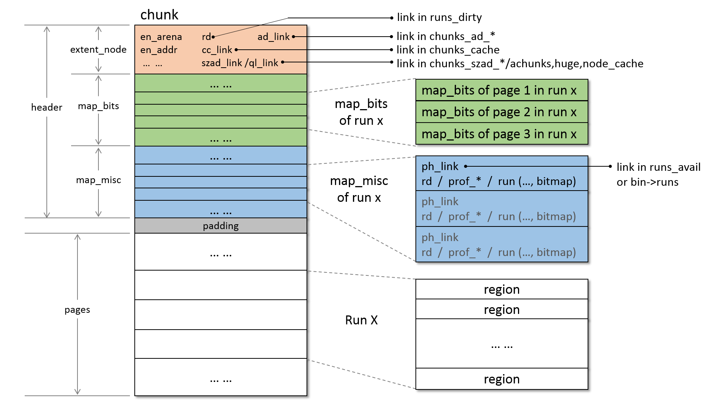
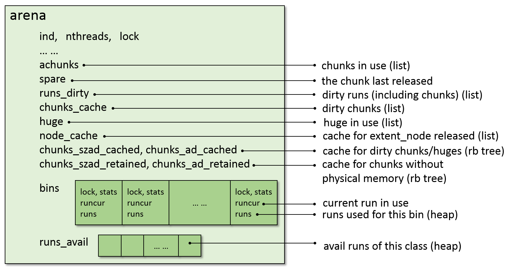
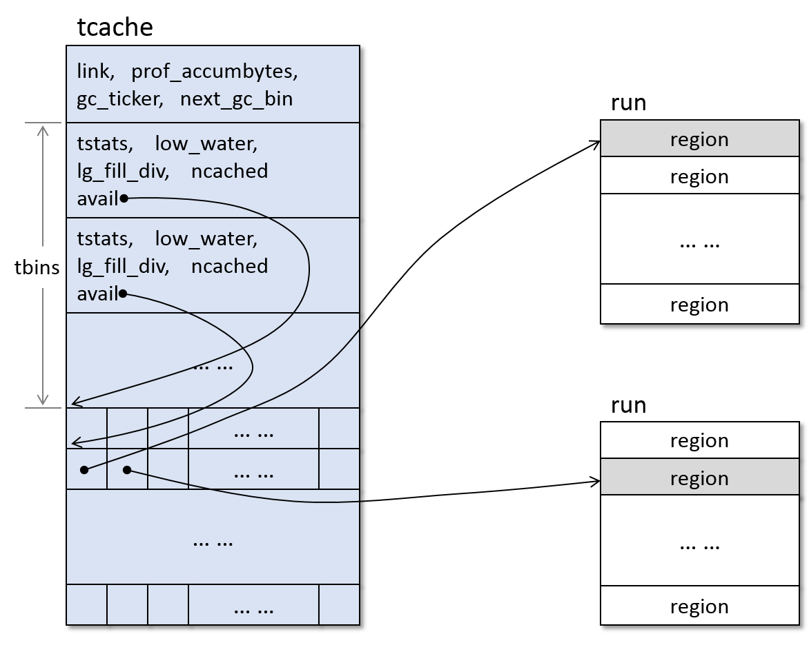

## 数据结构
前面简要介绍了 jemalloc 的数据结构和系统架构，下面来结合代码详细看看 jemalloc
的数据结构。

### chunk,run
首先来看两个和物理布局相关的数据结构：chunk，run。

```
struct arena_chunk_s {
	extent_node_t		node;
	arena_chunk_map_bits_t	map_bits[1];
};
```
chunk 数据结构很简洁，然而并不简单。node 中记录了 chunk 的属性信息(如 addr)、
管理信息(如 cc_link) 等等。
map_bits 记录着 chunk 中除了头部空间以外每一个 Page 的属性信息，这里 map_bits
数组长度并不是1，map_bits 在这里只是起到占位的作用，可以用来计算偏移，
知道 map_bits 的起始地址，而 map_bits 真正的长度是在运行时计算出来的，
计算过程见 arena.c 的 arena_boot 函数。
map_bits 之后还有一个 arena_chunk_map_misc_t(以下简称 map_misc) 数组，
其长度和 map_bits 一样，也是和每一个 Page 对应的，其真正的目的是用来记录、
管理 run 的，由于每一页都可能是 run，所以 map_misc 最多也是和页数一样多(除去头部
空间的页数)。

现在来看看和 chunk 相关的 map_bits、map_misc、run 的信息。

```
struct arena_chunk_map_bits_s {
	/*
	 * Run address (or size) and various flags are stored together.  The bit
	 * layout looks like (assuming 32-bit system):
	 *
	 *   ???????? ???????? ???nnnnn nnndumla
	 *
	 * ? : Unallocated: Run address for first/last pages, unset for internal
	 *                  pages.
	 *     Small: Run page offset.
	 *     Large: Run page count for first page, unset for trailing pages.
	 * n : binind for small size class, BININD_INVALID for large size class.
	 * d : dirty?
	 * u : unzeroed?
	 * m : decommitted?
	 * l : large?
	 * a : allocated?
	 *
	 * Following are example bit patterns for the three types of runs.
	 *
	 * p : run page offset
	 * s : run size
	 * n : binind for size class; large objects set these to BININD_INVALID
	 * x : don't care
	 * - : 0
	 * + : 1
	 * [DUMLA] : bit set
	 * [dumla] : bit unset
	 *
	 *   Unallocated (clean):                    
	 *     ssssssss ssssssss sss+++++ +++dum-a  ---- first page mapbit
	 *     xxxxxxxx xxxxxxxx xxxxxxxx xxx-Uxxx  ---- internal page mapbit
	 *     ssssssss ssssssss sss+++++ +++dUm-a  ---- last page mapbit
	 *
	 *   Unallocated (dirty):
	 *     ssssssss ssssssss sss+++++ +++D-m-a
	 *     xxxxxxxx xxxxxxxx xxxxxxxx xxxxxxxx
	 *     ssssssss ssssssss sss+++++ +++D-m-a
	 *
	 *   Small:
	 *     pppppppp pppppppp pppnnnnn nnnd---A
	 *     pppppppp pppppppp pppnnnnn nnn----A
	 *     pppppppp pppppppp pppnnnnn nnnd---A
	 *
	 *   Large:
	 *     ssssssss ssssssss sss+++++ +++D--LA
	 *     xxxxxxxx xxxxxxxx xxxxxxxx xxxxxxxx
	 *     -------- -------- ---+++++ +++D--LA
	 *
	 *   Large (sampled, size <= LARGE_MINCLASS):
	 *     ssssssss ssssssss sssnnnnn nnnD--LA
	 *     xxxxxxxx xxxxxxxx xxxxxxxx xxxxxxxx
	 *     -------- -------- ---+++++ +++D--LA
	 *
	 *   Large (not sampled, size == LARGE_MINCLASS):
	 *     ssssssss ssssssss sss+++++ +++D--LA
	 *     xxxxxxxx xxxxxxxx xxxxxxxx xxxxxxxx
	 *     -------- -------- ---+++++ +++D--LA
	 */
	size_t				bits;
#define	CHUNK_MAP_ALLOCATED	((size_t)0x01U)
#define	CHUNK_MAP_LARGE		((size_t)0x02U)
#define	CHUNK_MAP_STATE_MASK	((size_t)0x3U)

#define	CHUNK_MAP_DECOMMITTED	((size_t)0x04U)
#define	CHUNK_MAP_UNZEROED	((size_t)0x08U)
#define	CHUNK_MAP_DIRTY		((size_t)0x10U)
#define	CHUNK_MAP_FLAGS_MASK	((size_t)0x1cU)

#define	CHUNK_MAP_BININD_SHIFT	5
#define	BININD_INVALID		((size_t)0xffU)
#define	CHUNK_MAP_BININD_MASK	(BININD_INVALID << CHUNK_MAP_BININD_SHIFT)
#define	CHUNK_MAP_BININD_INVALID CHUNK_MAP_BININD_MASK

#define	CHUNK_MAP_RUNIND_SHIFT	(CHUNK_MAP_BININD_SHIFT + 8)
#define	CHUNK_MAP_SIZE_SHIFT	(CHUNK_MAP_RUNIND_SHIFT - LG_PAGE)
#define	CHUNK_MAP_SIZE_MASK						\
    (~(CHUNK_MAP_BININD_MASK | CHUNK_MAP_FLAGS_MASK | CHUNK_MAP_STATE_MASK))
};
```
上述是 map_bits 的数据结构，其注释已经交代得十分清楚了，这里再说明一下。首先，map_bits 中
只有一个 `size_t bits;` ，一个32位(在32位系统上)的标记，该标记分为三类：
unallocated，small，large。对于一个 unallocated 或 small 或 large 的 run，其往往有
多个页面组成，因此对应页面的 map_bits 也会联合表示一个 run 的状态属性。上述注释中的五个样例
中每一个都给出了三行，其中第一行是该run第一页对应的map_bits的含义，第二行是该run中间页面对应的
map_bits的含义，第三行是该run最后一页对应的 map_bits 的含义。
最后，上述数据结构中还定义了很多宏，用来从 map_bits 中提取对应的信息。

```
typedef struct arena_run_s arena_run_t;

/*
 * small run 的元数据
 * 存放在 arena_chunk_map_misc_t 中 (arena_chunk_map_misc_t 存在 chunk_header)
 */
struct arena_run_s {
	/* 该 run 的 bin index */
	szind_t		binind;

	/* 可用的 region 的数量 */
	unsigned	nfree;

	/* 标记每个 region 是否可用的 bitmap */
	/* 这是一个 多级 的 bitmap，具体实现见 bitmap.h */
	bitmap_t	bitmap[BITMAP_GROUPS_MAX];
};

/* qr 是通过宏实现的 双向环形列表 */
struct arena_runs_dirty_link_s {
	qr(arena_runs_dirty_link_t)	rd_link;
};

/* map_misc 保存在 chunk 的 header 中，并不和其相关的 run 存在一起 */
struct arena_chunk_map_misc_s {
	/*
	 * ph_link 用于构建 run 的堆，有两个互斥的使用场景：
	 * 1) arena 的 runs_avail 堆，管理 arena 中可用的 run
	 * 2) arena 的 bin 的 runs 堆，管理分配给某个 bin 的 run
	 */
	phn(arena_chunk_map_misc_t)		ph_link;

	union {
		/* 用来链接 dirty run, arena 的 runs_dirty 就是使用 rd 构建 */
		arena_runs_dirty_link_t		rd;

		/* 用于 profile */
		union {
			void			*prof_tctx_pun;
			prof_tctx_t		*prof_tctx;
		};

		/* small region 的元数据，指向上面的 arena_run_s */
		arena_run_t			run;
	};
};
```
上面是和 run 相关的一些重要的数据结构，对于数据结构中的每一个属性，上面都给出了解释，这里不
赘述。不过，要强调的是，map_misc 是非常重要的数据结构，其记录了 run 相关的重要信息，然而其
不存储在 run 中，而在chunk header 中，并且 map_misc 中有 ph_link、rd 等链接，用于链接
成 堆、链表，并且可以同时挂在 堆和链表中，完成复杂的数据管理。而对 run 的管理都是通过 map_misc
完成的，真实的 run 只是用来存储应用数据的，没有元数据。

现在再看看 extent_node_t :
```
struct extent_node_s {
	/* 记录该 node 隶属哪个 arena */
	arena_t			*en_arena;

	/* 指向该 node 表示的区域的地址 */
	void			*en_addr;

	/* 该 node 表示的区域的大小 */
	size_t			en_size;

	/* 该 node 表示的区域是否是全0 */
	bool			en_zeroed;

	/* 标记物理内存是否 commit，该标记和操作系统的 overcommit 有一定相关性 */
	bool			en_committed;

	/* 标记该 node 的是否是 arena 的 chunk？ 或者是是 huge 的 node？ */
	bool			en_achunk;

	/* Profile 相关 */
	prof_tctx_t		*en_prof_tctx;

	/*
	 * rd, cc_link 用来将 node 链接到 arena 的 runs_dirty 和 chunks_cache 中
	 * 虽然 node 表示的是 chunk 或 huge，但还是会被链到 runs_dirty 中，从而使
	 * chunks_cache 成为 runs_dirty 的子序列，方便 arena_purge_to_limit 遍历回收
	 */
	arena_runs_dirty_link_t	rd;
	qr(extent_node_t)	cc_link;

	union {
		/* 用来链接成 首先按照大小，其次按照地址排序的 红黑树 */
		rb_node(extent_node_t)	szad_link;

		/* 用来链接到 arena 的 achunks 或者 huge 或者 node_cache 列表中 */
		ql_elm(extent_node_t)	ql_link;
	};

	/* 用来连接成 地址排序的 红黑树*/
	rb_node(extent_node_t)	ad_link;
};
```
上述展示了 extent_node_s 的内容及每个成员的含义，其中可以看出 node 中包含很多用来链接的成员，
这样一个 node 可以同时链接到多个数据结构中，比如 szad_link、ad_link 可以使 node 同时挂在
两棵红黑树中，实际上代码中也是这么使用的。这样可以通过多种方式管理 node。

下面给出 chunk/run 在内存中的实际布局：


图中：
* map_bits、map_misc 的个数和页面的个数相同，这是因为一个chunk
最多有和页面相同个数的 run，但是并不是每一个 map_bits、map_misc
都有用
* run 的第一个 map_bits 和最后一个 map_bits 是有用的，中间的
map_bits 有时有用，有时没用，见上面对于 map_bits 的解释
* run 的第一个 map_misc 是有用的，后面的 map_misc 是没用的
* run 在使用中时，map_misc 中的 run结构中有一个 bitmap 记录
着 实体 run 中 region 的使用情况
* 图中只画了 small bin run 的情形，如果是 large run，那么
run 中没有 region

> 补充：commit/decommit 及 overcommit
>
> run 标志中的 decommitted、extent_node 中的 en_committed 及 代码中的 chunk commmit/decommit、
操作系统的 overcommit 参数都是相关的。
>
> 操作系统的 overcommit 表示对内存的管理策略，其值可以为 0、1、2 三种。
> * 0 表示申请内存时，操作系统检验是否有可用内存用来分配，没有则失败，该情况下，申请的地址空间
不会大于物理内存
> * 1 表示申请内存时，操作系统不做检验，满足该申请，而当真实使用量超过物理内存时，系统杀进程。
因为应用申请内存时，并没有分配实际内存，只是申请地址空间，真正使用的时候才会分配物理内存
> * 2 表示允许一定的超出申请，超出额度通过设置 ratio 参数控制
>
> 而操作系统并不是所有地址空间都计入使用量，从而检验是否超额的。mmap 有一个 protection 参数，
当该参数是 PROT_READ/PROT_WRITE 等非 PROT_NONE 选项时，该地址是计入使用量的，而
参数是 PROT_NONE 时，操作系统并不将该地址空间计入使用量，相当于释放地址空间。
>
> jemalloc 实现中考虑了操作系统的 overcommit 技术。
> * 如果操作系统开启 overcommit (即 overcommit不为 0，允许地址空间超额使用)，
jemalloc 不会对回收的地址空间进行 decommit (即 不使用 mmap PROT_NONE
选项释放地址空间)，调用 chunk decommit 的时候，实际上什么都不做
> * 如果操作系统未开启 overcommit，那么jemalloc要节约使用地址空间，有内存需要释放时，同时还需要
释放该内存的地址空间，这种情况下，调用 chunk_decommit 是会使用 mmap 的 PROT_NONE 来释放地址空间的，
同时引入 run 的 decommitted 以及extent_node 中的 en_committed 来表示这种状态。


### arena/bin
这一节介绍中央管理器相关的数据结构。

首先介绍一下 jemalloc 中内存大小分类的设计。jemalloc 中将内存按照大小分成 small bin class,
large class, huge class。每一类又划分成很多子类，每个子类是一种尺寸。每一类的具体大小由
size_classes.sh 生成的 size_classes.h 决定，size_classes.h 在运行时会被部分计算成
size classes 映射表放在内存中，还有一部分用的时候计算得出。下面给出在本人平台上 size 的分类情况：

| Category | Spacing | Size |
|----------|---------|------|
|small bin | 8       | 8    |
|          | 16      | 16,32,48,64,80,96,112,128 |
|          | 32      | 160,192,224,256 |
|          | 64      | 320,384,448,512 |
|          | 128     | 640,768,896,1024 |
|          | 256     | 1280,1536,1792,2048 |
|          | 512     | 2560,3072,3584,4096 |
|          | 1K      | 5K,6K,7K,8K |
|          | 2K      | 10K,12K,14K |
| large    | 4K      | 16K,20K,24K,28K,32K |
|          | 8K      | 40k,48K,56K,64K |
|	         | 16K     | 80K,96K,112K,128K |
|					 | 32K     | 160K,192K,224K,256K |
|					 | 64K     | 320K,384K,448K,512K |
|					 | 128K    | 640K,768K,896K,1024K |
|					 | 256K    | 1280K,1536K,1792K,2048K |
| huge     | 512K    | 2560K,3072K,3584K,4096K |
|          | 1M      | 5M,6M,7M,8M |
|          | 2M			 | 10M,12M,14M,16M |
|          | ...     | ... ... |
|          | 2^59		 | 2882303761517117440,3458764513820540928,4035225266123964416,4611686018427387904 |
|          | 2^60    | 5764607523034234880,6917529027641081856,8070450532247928832 |

下面看看 arena_bin_info 的结构，该结构全局只有一份，用来保存每一类 bin 的属性信息：
```
/* small bin 的属性信息，全局共享一份 */
struct arena_bin_info_s {
	/* region size */
	size_t			reg_size;

	/* Redzone size，默认是 0 */
	size_t			redzone_size;

	/* Interval between regions (reg_size + (redzone_size << 1)). */
	size_t			reg_interval;

	/* 该 run 的总大小，一个 run 由多个 page 组成，可以分成 整数个 region */
	/* 比如，arena_bin_info[3]，reg_size=48, run_size=12288,由3个页组成 */
	size_t			run_size;

	/* run 中 region 个数 */
	uint32_t		nregs;

	/* bitmap 的基本信息，用于生成 bitmap */
	bitmap_info_t		bitmap_info;

	/* region 0 在run 中的偏移，默认为 0 */
	uint32_t		reg0_offset;
};
```

再来看看 arena_bin 的数据结构，该结构十分重要，其维护着某个 bin 的可用 run，
从而为分配、回收 small bin 提供支撑。
```
/* arena_bin_s 是 arena 用来管理 small bin 的数据结构 */
struct arena_bin_s {
	/* 对 runcur,runs,stats 的操作需要该lock */
	malloc_mutex_t		lock;

	/* runcur : 当前用于分配 bin 的run */
	arena_run_t		*runcur;

	/*
	 * 维护分配给该 bin 的非空、非满 run 的堆
	 * 分配给 bin 的 run 会从 arena->runs_avail 中删除，arena 认为已经分配出去了
	 * 当 runcur 用完时，需要在 runs 中寻找地址较低的run作为新runcur
	 * full run 会被回收，不需要记录
	 * empty run 不用记录，在释放一个 region 到 empty run 时，
	 *       该 run 会被重新记录到 runs 或者 runcur 中
	 */
	arena_run_heap_t	runs;

	/* bin 统计数据 */
	malloc_bin_stats_t	stats;
};
```

现在还是最复杂也是最核心的数据结构 arena ：
```
/* arena 数据结构 */
struct arena_s {
	/* 该 arena 在 arena 数组中的 index */
	unsigned		ind;

	/*
	 * 每个线程选择两个 arena,一个用于 application,一个用于 internal metadata
	 * 这里 nthreads 是统计使用该 arena 的线程数量
	 *   0: Application allocation.
	 *   1: Internal metadata allocation.
	 */
	unsigned		nthreads[2];

	/*
	 * There are three classes of arena operations from a locking
	 * perspective:
	 * 1) Thread assignment (modifies nthreads) is synchronized via atomics.
	 * 2) Bin-related operations are protected by bin locks.
	 * 3) Chunk- and run-related operations are protected by this mutex.
	 */
	malloc_mutex_t		lock;

	arena_stats_t		stats;

	/* 与该 arena 相关的 tcache */
	ql_head(tcache_t)	tcache_ql;

	uint64_t		prof_accumbytes;

	/*
	 * PRNG state for cache index randomization of large allocation base
	 * pointers.
	 */
	uint64_t		offset_state;

	dss_prec_t		dss_prec;


	/* 
	 * 正在占用的 chunks 
	 * 占用的意思是该 chunk 被切成了 runs，这些 runs 可能正在使用，可能没有在使用
	 * 而且，这些 runs 不能合并成 maxrun，如 chunk = run_1 of zeroed + run_2 of dirty
	 */
	ql_head(extent_node_t)	achunks;

	/* spare 用于暂存刚刚释放的 chunk,以便之后再使用 */
	arena_chunk_t		*spare;

	/* Minimum ratio (log base 2) of nactive:ndirty. */
	ssize_t			lg_dirty_mult;

	/* 置为 True，如果正在执行 arena_purge_to_limit(). */
	bool			purging;

	/* 使用中的 runs,huge 的页面数 */
	size_t			nactive;

	/* 脏页面数量，不使用但是有物理页面映射的页面属于脏页 */
	size_t			ndirty;

	/*
	 * chunks_cache,runs_dirty 用于管理不使用的脏内存
	 *
	 *   LRU-----------------------------------------------------------MRU
	 *
	 *        /-- arena ---\
	 *        |            |
	 *        |------------|                             /- chunk -\
	 *   ...->|chunks_cache|<--------------------------->|  /----\ |<--...
	 *        |------------|                             |  |node| |
	 *        |            |    /- run -\    /- run -\   |  |    | |
	 *        |            |    |       |    |       |   |  |    | |
	 *        |------------|    |-------|    |-------|   |  |----| |
	 *   ...->|runs_dirty  |<-->|rd     |<-->|rd     |<---->|rd  |<----...
	 *        |------------|    |-------|    |-------|   |  |----| |
	 *        |            |    |       |    |       |   |  |    | |
	 *        |            |    |       |    |       |   |  \----/ |
	 *        |            |    \-------/    \-------/   |         |
	 *        \------------/                             \---------/
	 *
	 * * run 的 rd 不在 run 中，在 run 的 map_misc 中
	 * * 如果 chunk 是 简单的chunk， chunk 的 rd 在chunk头部的 extent node 中
	 * * 如果 chunk 是 huge， huge 的 node 是额外分配的，rd在额外分配的node中
	 * * dirty chunk/huge 虽然不是 run，但是也会被链进 runs_dirty 中
	 * * 这样方便在 arena_purge_to_limit 中进行回收
	 */
	arena_runs_dirty_link_t	runs_dirty;
	extent_node_t		chunks_cache;

	/*
	 * 以下忽略与 decay 相关的一些参数
	 */
	ssize_t			decay_time;
	nstime_t		decay_interval;
	nstime_t		decay_epoch;
	uint64_t		decay_jitter_state;
	nstime_t		decay_deadline;
	size_t			decay_ndirty;
	size_t			decay_backlog_npages_limit;
	size_t			decay_backlog[SMOOTHSTEP_NSTEPS];

	/* huge 分配的内存 */
	ql_head(extent_node_t)	huge;
	/* Synchronizes all huge allocation/update/deallocation. */
	malloc_mutex_t		huge_mtx;

	/*
	 * 缓存可以复用的 chunks，均使用 红黑树 管理
	 * szad 表示 size-address-ordered，按照 大小 排序，大小相同，则按照 地址 排序
	 * ad 表示 address-ordered，按照地址排序
	 * cached 表示 地址空间还在，物理地址映射还在
	 * retained 表示 地址空间还在，物理地址映射不在
	 * 所以，使用的时候，cached复用更快，优先级更高
	 */
	extent_tree_t		chunks_szad_cached;
	extent_tree_t		chunks_ad_cached;
	extent_tree_t		chunks_szad_retained;
	extent_tree_t		chunks_ad_retained;

	malloc_mutex_t		chunks_mtx;
	/* 缓存用 base_alloc 分配的 extent node */
	ql_head(extent_node_t)	node_cache;
	malloc_mutex_t		node_cache_mtx;

	/* 用户自定义 chunk 的操作函数 */
	chunk_hooks_t		chunk_hooks;

	/* 管理该 arena 的 bin，bin的结构在上面已经解释过 */
	arena_bin_t		bins[NBINS];

	/*
	 * 管理该 arena 可用的 runs
	 * runs_avail 有多个，启动时决定创建数量
	 * runs_avail 的分组是根据实际申请 run 时可能出现的大小进行分类的
	 * run 会按照 size 大小划分到对应的 runs_avail 中
	 * 这里将 run 链接成堆都是通过 run 的 map_misc 完成的
	 */
	arena_run_heap_t	runs_avail[1]; /* Dynamically sized. */
};

```

下面给出 arena、bin 的结构图：


图中：
* runs_dirty 链接 dirty runs，但是 dirty chunks/huges
也会被链接进来，所以 chunks_cache 是 runs_dirty 子序列
* chunks_szad_cached 和 chunks_ad_cached 都是链接 dirty
chunks 的红黑树，只是编排方式不一样，但是链接的是同一群 chunks
node，因为 extent_node 中有多条可以链接的边，这在上面的 extent_node 数据结构中解释过
* dirty chunks 不仅链接在 chunks_szad/ad_cached 中，也链接
在了 chunks_cache 中，chunks_cache 遍历，chunks_szad/ad_cached 用来查找
* chunks_szad/ad_retained 也是红黑树，链接 物理地址映射被取消
的 chunks/huges
* bins 中的 runs 是 非空、非满的，满的 run 会回收进 runs_avail
中，空的不纪录在任何结构中，当其回收的时候再被链接进数据结构中


### tcache
这一部分介绍线程缓存相关的结构。

```
/* 全局保留一份，记录 tcache 在对于每个 bin 最多缓存的个数 */
struct tcache_bin_info_s {
	unsigned	ncached_max;
};

/* tcache 中 bin 的数据结构，记录、管理每一个bin 的状态 */
struct tcache_bin_s {
	tcache_bin_stats_t tstats;
	int		low_water;	/* Min # cached since last GC. */
	unsigned	lg_fill_div;	/* Fill (ncached_max >> lg_fill_div). */
	/* 当前缓存的数量 */
	unsigned	ncached;	/* # of cached objects. */
	/*
	 * 根据 tcache_bin_info_s 中的 ncached_max 为该 bin 申请指定数量的指针空间
	 * 来指向缓存的 region (region 是 run 划分出的实际分配的单元)
	 */
	void		**avail;	/* Stack of available objects. */
};

/*
 * tcache 数据结构，管理 tcache 下所有 bin
 *   
 *             +---------------------+
 *           / | link                |
 * tcache_t <  | prof_accumbytes     |
 *           | | gc_ticker           |
 *           \ | next_gc_bin         |
 *             |---------------------|
 *           / | tstats              |
 *           | | low_water           |
 * tbins[0] <  | lg_fill_div         |
 *           | | ncached             |
 *           \ | avail               |--+
 *             |---------------------|  |
 *           / | tstats              |  |
 *           | | low_water           |  |
 *           | | lg_fill_div         |  |                     Run
 * tbins[1] <  | ncached             |  |                +-----------+
 *           | | avail               |--|--+             |  region   |
 *           \ |---------------------|  |  |             |-----------|
 *             ...  ...  ...            |  |   +-------->|  region   |
 *             |---------------------|  |  |   |         |-----------|
 *             | padding             |  |  |   |         |  region   |
 *             |---------------------|<-+  |   |         |-----------|
 *             | stack[0]            |-----|---+   +---->|  region   |
 *             | stack[1]            |-----|-------+     |-----------|
 *             | ...                 |     |             |  region   |
 *             | stack[ncache_max-1] |     |             |-----------|
 *             |---------------------|<----+      +----->|  region   |
 *             | stack[0]            |------------+      |-----------|
 *             | stack[1]            |                   |           |
 *             | ...                 |                   |           |
 *             | stack[ncache_max-1] |                   |           |
 *             |---------------------|                   |           |
 *             ...  ...  ...                             ...  ...  ...
 *             +---------------------+                   +-----------+
 *
 *
 */
struct tcache_s {
	ql_elm(tcache_t) link;		/* Used for aggregating stats. */
	uint64_t	prof_accumbytes;/* Cleared after arena_prof_accum(). */
	ticker_t	gc_ticker;	/* Drives incremental GC. */
	szind_t		next_gc_bin;	/* Next bin to GC. */
	/* tbins 有多个，具体个数是运行时决定的，空间也是运行时申请的 */
	tcache_bin_t	tbins[1];	/* Dynamically sized. */
};

```

这里给出 tcache 的结构布局：


图中：
* tbin 中的 avail 是指向指针数组的指针，指向的指针数组中存着
缓存的 region 的地址，而 run 中的该 region 被标记成已经分配
