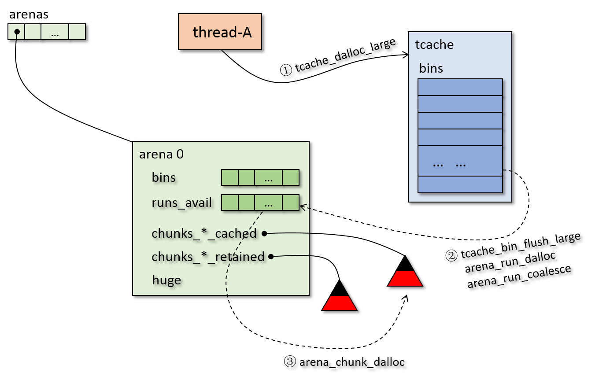
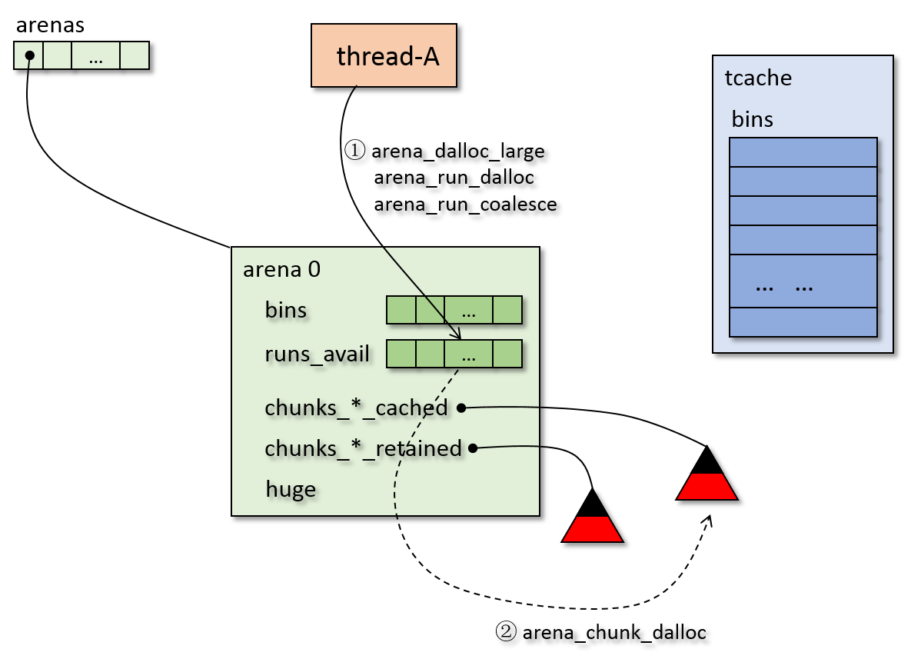
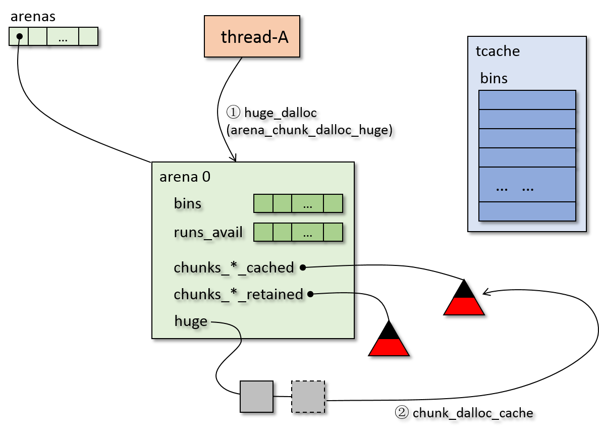

## free 流程
这部分主要解释 free 的工作流程。

下面给出 free 的主体函数的流程：
```
je_free (jemalloc.c)
|
+--ifree (jemalloc.c)
   |
   +--更新统计数据
   |
   +--iqalloc (jemalloc_internal.h)
      |
	  +--idalloctm (jemalloc_internal.h)
	     |
         +--arena_dalloc (arena.h)
            |
            +--获取释放地址所在的chunk的地址
            |
            +-[?] chunk 地址不等于 释放地址
               |  说明释放空间是 small 或者 large，不是 huge
               |
               Y--+--获取释放地址在 chunk 中的 pageind,mapbits
               |  |
               |  +-[?] 根据 mapbits 判断是否是 small
               |     |
               |     Y-[?] tcache != NULL
               |     |  |
               |     |  Y--tcache_dalloc_small
               |     |  |  (具体内容见下文)
               |     |  |  
               |     |  N--arena_dalloc_small
               |     |     (具体内容见下文)
               |     |
               |     N-[?] tcache != NULL & size-large_pad <= tcache_maxclass
               |        |
               |        Y--tcache_dalloc_large
               |        |  (具体内容见下文)
               |        |
               |        N--arena_dalloc_large
               |           (具体内容见下文)
               |
			   N--huge_dalloc
                  (具体内容见下文)
```
free 的主体流程很清晰，基本就是 malloc 的逆过程，在默认 tcache 开启的情况下按照四种尺寸分别调用：
tcache_dalloc_small、tcache_dalloc_large、arena_dalloc_large、huge_dalloc 来释放内存。
如果 tcache 关闭，则使用 arena_dalloc_small、arena_dalloc_large、huge_dalloc 来释放内存。

下面来看 tcache 开启的情况下的四种情形：

首先，释放 small bin 时，重要的流程见下图：

上图中：
* 步骤一：调用接口将 small 释放到 tcache 中，如果 tcache 中有空间释放，那么返回；如果
tcache 中对应 bin 满了，那么触发 步骤二
* 步骤二：对该 bin 执行 flush，将其部分 region 释放到 arena 的 bin 中，如果释放到
arena 的 bin 的run 中时，run 没满，那么返回步骤一；如果 arena 中 bin 的run满了，
那么触发步骤三
* 步骤三：将arena 的 bin 中的满的run释放回 arena 的 runs_avail 中，释放过程中，
会将 run 和前后可合并的 run 合并，如果合并后的 run 不是 整个chunk，那么放入 runs_avail，
返回 步骤二，如果合并后的 run 是 一个 chunk，那么触发步骤四
* 步骤四：释放chunk到 chunks_szad/ad_cached

上述过程和 malloc 的过程可以对应上，很好理解。下面看一看具体的流程：
```
tcache_dalloc_small (tcache.h)
|
+-[?] tbin 满了
|  |
|  +--tcache_bin_flush_small (tcache.c)
|     |
|     +--循环：每次回收同一个 arena 中的 bin，直到达到回收数量
|     |  |
|     |  +--找到属于某个 arena 的 bin，调用 arena_dalloc_bin_junked_locked 回收
|     |  |  arena_dalloc_bin_junked_locked 会调用 arena_dalloc_bin_locked_impl 回收
|     |  |  (arena_dalloc_bin_locked_impl 具体内容见下文)
|     |  |
|     |  +--arena_decay_ticks
|     |     更新时钟计数，并可能触发 arena_purge
|     |
|     +--更新统计，整理 tbin->avail 数组
|
+--将要释放的 bin 放入 tbin->avail 中，并更新 ncached
|
+--tcache_event
   更新 ticker，并可能出发 tcache_event_hard 对 bin 进行回收
```
上述有些子过程太长，我们放在下文解释。

下图是将 large 释放回 tcache 的过程：

上图不难理解，这里就不解释了，下面是具体流程：
```
tcache_dalloc_large (tcache.h)
|
+-[?] tbin 满了
|  |
|  +--tcache_bin_flush_large (tcache.c)
|     |
|     +--循环：每次回收同一个 arena 中的 bin，直到达到回收数量
|     |  |
|     |  +--找到属于某个 arena 的 bin，调用 arena_dalloc_large_junked_locked 回收
|     |  |  arena_dalloc_large_junked_locked 会调用 arena_dalloc_large_locked_impl 回收
|     |  |  (arena_dalloc_large_locked_impl 具体内容见下文)
|     |  |
|     |  +--arena_decay_ticks
|     |     更新时钟计数，并可能触发 arena_purge
|     |
|     +--更新统计，整理 tbin->avail 数组
|
+--将要释放的 bin 放入 tbin->avail 中，并更新 ncached
|
+--tcache_event
   更新 ticker，并可能出发 tcache_event_hard 对 bin 进行回收
```

下面是 arena large 的释放：

具体流程如下：
```
arena_dalloc_large
|
+--arena_dalloc_large_locked_impl
   |
   +--更新统计参数
   |
   +--arena_run_dalloc
      (具体内容见上文)

```

再来看 huge 的释放：

具体流程如下：
```
huge_dalloc
|
+--huge_node_unset
|  |
|  +--chunk_deregister 将 huge node 从基数树中注销
|
+--ql_remove 将 huge node 从 arena->huge 中删除
|
+--arena_chunk_dalloc_huge
|  |
|  +--更新统计数据
|  |
|  +--chunk_dalloc_cache
|     (具体内容见上文)
|
+--idalloctm
|  将 huge node 的空间释放
|  |
|  +--arena_dalloc
|     (具体内容见上文)
|
+--arena_decay_tick
   更新 ticker，并可能触发 arena_purge 内存清理

```

最后来看看当 tcache 关闭时，将 small 释放到 arena 的过程：
```
arena_dalloc_small (arena.c)
|
+--arena_dalloc_bin (arena.c)
|  |
|  +--arena_dalloc_bin_locked_impl (arena.c)
|     |
|     +--arena_run_reg_dalloc
|     |  将 region 放回 run 中
|     |  |
|     |  +--bitmap_unset 修改 run 的 bitmap
|     |  |
|     |  +--更新 run->nfree
|     |
|     +-[?] run->nfree == bin_info->nregs
|     |  |  该run所有的 region 都释放了
|     |  |      
|     |  Y--+--arena_dissociate_bin_run (arena.c)
|     |  |  |  |
|     |  |  |  +-[?] run == bin->runcur
|     |  |  |     |
|     |  |  |     Y--将 bin->runcur 置为 NULL
|     |  |  |     |
|     |  |  |     N--如果该 bin 的 run 的容量大于一个 region，那么
|     |  |  |        调用 arena_run_heap_remove 将 run 从 bin->runs 中移除
|     |  |  |        (如果bin的run的容量就是一个region，那么不需要移除,
|     |  |  |         因为 bin->runs 中是 non-full non-empty runs，该run
|     |  |  |         在本次释放前是empty，所以不在 runs 中)
|     |  |  |
|     |  |  +--arena_dalloc_bin_run (arena.c)
|     |  |     |
|     |  |     +--arena_run_dalloc (arena.c)
|     |  |        释放该 run (具体内容见下文)
|     |  |  
|     |  N-[?] run->nfree == 1 & run != bin->runcur
|     |     |  现在 nfree=1，说明之前该 run 为空，不在 runs 中
|     |     |
|     |     Y--arena_bin_lower_run (arena.c)
|     |        将 run，runcur 中地址低的作为 runcur，地址高的使用  
|     |        arena_bin_runs_insert 放入 bin->runs
|     |
|     +--更新统计信息
|
+--arena_decay_tick
   更新 ticker，并可能触发 arena_purge 内存清理

```
上述释放 small bin 的过程可能会触发 run 的释放，下面给出 run 的释放的过程：

```
arena_run_dalloc (arena.c)
|
+--获取相关参数
|
+--设置 run 在 chunk 中的 bitmaps
|
+--arena_run_coalesce (arena.c)
|  通过 mapbits 标志，尝试将该 run 和前后的 run 合并
|  (具体实现见代码)
|
+--arena_avail_insert (arena.c)
|  将该run插入 runs_avail
|
+--如果该 run 是 dirty，调用 arena_run_dirty_insert 插入 runs_dirty
|
+-[?] 合并后的 run 是一个 chunk
|  |
|  Y--arena_chunk_dalloc (arena.c)
|     将 chunk 从正在占用的 chunks 中删除
|     |
|     +--arena_avail_remove 将 run 从 arena->runs_avail 中移除
|     |
|     +--ql_remove 将 chunk 从 arena->achunks 中移除
|     |
|     +--将该 chunk 设置为 arena->spare
|     |
|     +--arena_spare_discard (arena.c)
|        将 旧的 spare 释放掉
|        |
|        +--如果旧的 spare 为 dirty，则用 arena_run_dirty_remove 从 runs_dirty 中移除
|        |
|        +--arena_chunk_discard (arena.c)
|           |
|           +--chunk_deregister 将chunk从基数树从移除
|           |
|           +--根据 chunk 的 maxrun 的 mapbits 的 committed 标志，
|           |  尝试 decommit chunk 的 header 的物理地址
|           |  (这一步真的会执行到，当 chunk 的 maxrun 被 decommit 的时候会执行)
|           |  (说明 spare 的 maxrun 可能会 decommit，而 run 在用的时候会被commit)
|           |
|           +--chunk_dalloc_cache
|              |    
|              +--chunk_record 将 chunk 记录到 chunks_szad/ad_cached 树中
|              |  过程中会尝试与该chunk地址相邻的chunk合并
|              |  并尝试将 chunk 放到 runs_dirty,chunks_cache 中
|              |
|              +--arena_maybe_purge
|                 触发一次清理内存   
|        
+-[?] dirty
   |
   Y--arena_maybe_purge
      触发一次清理内存   
```
上述流程有些复杂，run 的释放可能会触发 chunk 的回收，chunk 的回收又涉及到 spare 指针
的维护，以及最后还会触发 内存清理，需要好好阅读代码。
