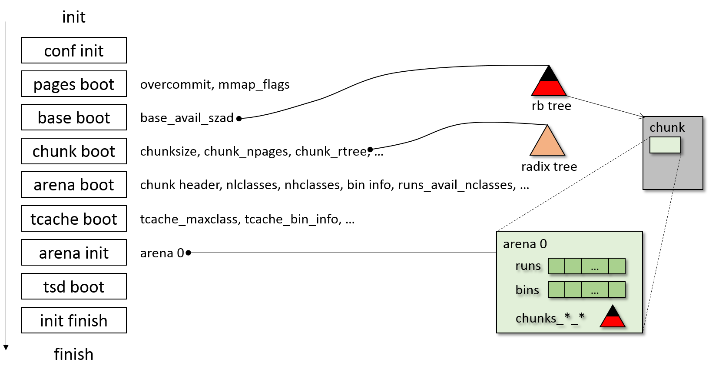

## 初始化

### 流程说明
jemalloc 在使用之前会先初始化，初始化基本就是初始化在数据结构一章解释的数据结构 以及
一些其他相关的初始化工作，先看一个初始化的过程图：


上图中基本给出了初始化中所有重要的步骤，下面来看看详细的流程分析：
```
jemalloc_constructor (jemalloc.c)
使用 gcc 的 constructor 特性将 jemalloc 初始化过程放在 main 之前执行
|
+--malloc_init (jemalloc.c)
   初始化 malloc
   |
   +--malloc_init_hard (jemalloc.c)
   |  |
   |  +--malloc_init_hard_needed (jemalloc.c)
   |  |  如果自己是初始化执行者，返回
   |  |  如果自己不是初始化执行者，等待别人初始化完成
   |  |
   |  +--malloc_init_hard_a0_locked (jemalloc.c)
   |  |  自己是初始化的执行者，执行初始化
   |  |  a0 指 arena 0，这里指该过程执行初始化直到 arena 0 初始化完成
   |  |  |
   |  |  +--malloc_conf_init (jemalloc.c)
   |  |  |  设置 malloc 的参数，比如 junk 等
   |  |  |
   |  |  +--pages_boot (pages.c)
   |  |  |  获取 overcommit 参数，设置 mmap_flags
   |  |  |
   |  |  +--base_boot (base.c)
   |  |  |  初始化 base_avail_szad 为 size-address-ordered 红黑树
   |  |  |
   |  |  +--chunk_boot (chunk.c)
   |  |  |  |
   |  |  |  +--初始化 chunk 参数，如chunksize、chunksize_mask、chunk_npages
   |  |  |  |  调用 chunk_dss_boot 初始化 sbrk 状态 (chunk_dss.c)
   |  |  |  |
   |  |  |  +--rtree_new 初始化 chunk_rtree (rtree_new 在 rtree.c 中)
   |  |  |     将 chunks_rtree_node_alloc 作为 rtree 的内存分配器
   |  |  |     chunks_rtree_node_alloc 使用 base_alloc 完成内存分配
   |  |  |
   |  |  +--ctl_boot (ctl.c)
   |  |  |
   |  |  +--arena_boot (arena.c)
   |  |  |  初始化 arena 相关的一些基本信息
   |  |  |
   |  |  +--tcache_boot (tcache.c)
   |  |  |  |
   |  |  |  +--确定 tcache_maxclass (tcache_maxclass 是 tcache 最大的 size)
   |  |  |  |  确定 nhbins (tcache 中 bin 的种数)
   |  |  |  |  (NBINS 是 small bin 的种数，我的环境下：NBINS=36，nhbins=41)
   |  |  |  |
   |  |  |  +--初始化 tcache_bin_info
   |  |  |     使用 base_alloc 为 tcache_bin_info 分配空间
   |  |  |     确定每种 tcache bin 本地缓存的数量 ncached_max 及缓存总数 stack_nelms
   |  |  |
   |  |  +--初始化 arenas 数组
   |  |  |  初始 arenas 数组中只有一个元素 a0 : arena 0
   |  |  |
   |  |  +--arena_init (jemalloc.c)
   |  |  |  初始化 0 号 arena, arena[0] 初始时候不绑定 tsd/thread
   |  |  |  初始化流程只初始化 arena[0]，更多的 arena 在用的时候再初始化
   |  |  |  |
   |  |  |  +--arena_init_locked (jemalloc.c)
   |  |  |     |
   |  |  |     +--arena_new (arena.c)
   |  |  |        新建一个 arena 并初始化
   |  |  |
   |  |  +--设置 malloc 状态为 malloc_init_a0_initialized
   |  |
   |  +--malloc_tsd_boot0 (tsd.c)
   |  |  |
   |  |  +--tsd_boot0 (tsd.h)
   |  |  |  tsd_boot0 是通过 malloc_tsd_protos 生成的
   |  |  |  通过 pthread_key_create 生成 thread specific data
   |  |  |  tcache指针 等数据就存放在 tsd 中
   |  |  |
   |  |  +--tsd_fetch (tsd.h)
   |  |  |  当 tsd 状态为 unitialized 时，fetch会将 tsd 的状态置为 nominal
   |  |  |
   |  |  +--设置 tsd_arenas_tdata_bypass 为 true
   |  |     tsd 的 arenas_tdata 是 ticker 的计数值，可是 arenas_tdata_bypass 是 ???
   |  |
   |  +--malloc_init_hard_recursible (jemalloc.c)
   |  |  |
   |  |  +--设置 malloc 状态为 malloc_init_recursible
   |  |  |
   |  |  +--pthread_atfork
   |  |     通过 pthread_atfork 设置 prefork, postfork 的 hook
   |  |     从而减少 multi-thread 及 fork 情况下的 deadlock
   |  |
   |  +--malloc_init_hard_finish (jemalloc.c)
   |  |  |
   |  |  +--根据 cpu 核数调整 arena 数组, 并使用 base_alloc 重新分配内存
   |  |     设置 malloc 状态为 malloc_init_intialized
   |  |     malloc_slow_flag_init (jemalloc.c) 设置 malloc_slow 标志(一般为 false)
   |  |
   |  +--malloc_tsd_boot1 (tsd.c)
   |     |
   |     +--tsd_boot1 : do nothing
   |        设置 tsd_arenas_tdata_bypass 为 false, ???
   |
   +--malloc_thread_init (jemalloc.c): do nothing
```
下面给出上述过程依赖的两个子过程 arena_boot 和 arena_new:
```
arena_boot (arena.c)
初始化 arena 相关的一些基本信息
|
+--设置 dirty_mult、decay_time 参数
|  这两个参数用来指导维护 active pages、dirty pages 平衡
|
+--通过3次迭代确定 chunk_header 大小
|  并确定 map_bias,arena_maxrun,nlclasses,nhclasses等
|
+--bin_info_init (arena.c)
|  |
|  +--初始化 arena_bin_info
|  |  使用 size_classes 及 BIN_INFO_INIT_bin_yes 初始化
|  |  只初始化 small bin
|  |  ( small bin 从 run 的 region 分配，large 直接使用 run 分配 )
|  |
|  +--bin_info_run_size_calc (arena.c)
|  |  为 small bin 计算合适的 run size，一个 run 由多个
|  |  page 组成，正好可以切成 整数个 bin 大小的 region
|  |  比如，arena_bin_info[3] reg_size=48,run_size=12288,
|  |  nregs=256, 该run就是由3个page组成
|  |
|  +--bitmap_info_init (bitmap.c)
|     计算每个 small bin 的 bitmap info
|
+--small_run_size_init (arena.c)
|  使用 base_alloc 为 small_run_tab 分配内存
|  small_run_tab 记录着 多少个page 可以组成一个 run
|  或者说，一个真实的 run 可能由多少page 组成
|  (一个真实的 run 可以切成整数个 region)
|
+--run_quantize_init (arena.c)
|  使用 base_alloc 为 run_quantize_ceil/floor_tab 分配空间
|  计算 run_quantize_ceil_tab, run_quantize_floor_tab
|  run_quantize_ceil_tab[i] 记录比 i 个 page 多的最小的真实 run
|  run_quantize_floor_tab[i] 记录比 i 个 page 少的最大的真实 run
|  (真实的 run 分为两种：small run 和 large run，对于 small run，
|   其真实 run 大小就是 small run 的大小，对于 large run，其
|   真实 run 的大小是 run_size+large_pad，默认 large_pad=PAGE)
|
+--确定 runs_avail_nclasses
   runs_avail_nclasses = size2index(maxrun) + 1 - size2index(PAGE)
   将 run 按 size2index 分类，将某一范围内的 run 放在一个 runs_avail 中
   实际分配时，将 run 多余请求的部分再重新放回 runs_avail
```

```
arena_new (arena.c)
新建一个 arena 并初始化
|
+--计算 arena_size
|  需要动态计算 runs_avail 的长度
|  
+--使用 base_alloc 申请 arena 空间
|  
+--初始化 arena 的 nthreads 和 统计数据
|  
+--初始化 arena->achunks (单链表)
|  achunks 记录正在占用的 chunks
|  
+--初始化 arena->runs_avail[i] (每个 runs_avail 是一个 堆)
|  每个 runs_avail 使用 heap 维护该类可用的 runs
|  
+--初始化 arena->runs_dirty (双向链表)  
|  runs_dirty 链接 dirty runs (同时将 dirty chunks 链进来)
|  
+--初始化 arena->chunks_cache (双向链表)
|  chunks_cache 链接 dirty chunks/huges
|  
+--(arena_decay_init, 默认使用 purge ratio,所以不执行)
|  
+--初始化 arena->huge (单链表)
|  huge 用来链接正在使用的 huge
|  
+--初始化 arena->chunks_szad_cached  
|  初始化 arena->chunks_ad_cached  
|  初始化 arena->chunks_szad_retained
|  初始化 arena->chunks_ad_retained
|  ( 均为红黑树，节点为 extent_node，chunks_szad/ad_cached
|    管理 dirty chunks，即 有物理内存映射的，这两颗树管理同
|    一组 chunks，使用 extent_node 中的不同边来链接，完成复杂
|    管理。chunks_szad/ad_retained 管理 没有物理内存映射的
|    chunks 地址空间。 szad:size-address, ad:address )
|  
+--初始化 arena->node_cache (单链表)  
|  node_cache 缓存使用 base_alloc 申请的 extent node 空间
|  
+--初始化 arena->chunk_hooks 为 默认的chunk hooks default  
|  
+--初始化 arena->bins
   初始化每个 arena->bins[i] 的 lock, runcur, runs(heap)
 
```

这里对上述流程中的一些地方做一些解释：
* base_alloc

jemalloc 本身是做内存分配的，然而 jemalloc 自己的数据结构也需要分配内存来存放，
而此时 jemalloc 还没有初始化完成，所以 jemalloc 中提供了一个 base 分配器，用来
做十分简单的分配工作，jemalloc 启动时的数据结构就是使用 base 完成分配的。base
分配器的代码在 base.c 中，代码功能十分简单，很容易看懂，这里不做过多解释。

* pthread_atfork

jemalloc 使用 pthread_atfork 绑定 prefork、postfork 的 hook function 是为了
减少 多线程、多进程 情况下出现的 deadlock，如果不使用 prefork、postfork
的 hook function，下面的情况就会出现死锁：
```
                           malloc-lock
                                |
            +---- thread-1 ----<1>--------------------    
            +---- thread-2 ---------------------------  +--------+
    main ---+-- main thread ---(a)--<2>---(b)---------  | Parent |
                                     |                  +--------+
    ---------------------------------|----------------------------
                                     +-- child --(c)--  +--------+
                                                        | Child  |
                                                        +--------+
```
**问题：**
父进程有多个线程，thread-1 在<1>处持有 malloc-lock 锁，而 main thread
在 <2> 处 fork 一个子进程，这个子进程会复制父进程中 main thread 的内存空间，
同时也将被 thread-1 持有的 malloc-lock 复制进来，而子进程中没有 thread-1，
该 malloc-lock 在子进程中存在而永远不会被释放，从而导致死锁。(fork 只复制
调用 fork 的线程，不会将父进程所有线程都复制过来)

**解决方法：**
main thread 在 fork 之前，即(a)处，获取所有锁，然后在 fork 之后，父进程
在 (b) 处，子进程在 (c) 处分别再释放所有锁。这就是 atfork 绑定 hook function
所做的事情。

* thread specific data

jemalloc 使用 pthread_key_create 为每个线程生成私有的存储空间，该 api 只
需要调用一次，所有线程都会拥有该同名的数据结构，而且线程独立访问，互不干扰。
在 jemalloc 中，每个线程的计时器、tcache指针就是存放在 TSD 中。

* true or false

在 jemalloc 中，函数的返回值是 false 表示执行正常，返回值是 true 时，表示
执行失败，这和 `*unix` 程序的返回值是一致的，返回0表示执行成功，返回非0
表示执行失败。

* 其他

流程中还有一些部分需要花点时间学习、思考的，比如 radix tree(基数树)、很多计算
过程具体的计算步骤 等等，由于我也没有看得特别详细，所以就不做过多解释。


### 源码说明
上述初始化流程中，大部分内容并不难懂，而且代码中我们加了注释，读起来应该难度不大，
下面针对一些稍复杂一点的代码做点解释。

* arena_boot 中3次迭代确定chunk header size
```c
	/*
	 * Compute the header size such that it is large enough to contain the
	 * page map.  The page map is biased to omit entries for the header
	 * itself, so some iteration is necessary to compute the map bias.
	 *
	 * 1) Compute safe header_size and map_bias values that include enough
	 *    space for an unbiased page map.
	 * 2) Refine map_bias based on (1) to omit the header pages in the page
	 *    map.  The resulting map_bias may be one too small.
	 * 3) Refine map_bias based on (2).  The result will be >= the result
	 *    from (2), and will always be correct.
	 */
	/*
	 * commented by yuanmu.lb
	 * (1) maybe too large, (2) maybe too small, (3) is a little large
	 * map_bias is number of pages for chunk header(including map)
	 * every page is associated with one arena_chunk_map_bits_t
	 * and one arena_chunk_map_misc_t
	 */
	map_bias = 0;
	for (i = 0; i < 3; i++) {
		size_t header_size = offsetof(arena_chunk_t, map_bits) +
		    ( ( sizeof(arena_chunk_map_bits_t) +
		        sizeof(arena_chunk_map_misc_t) ) * (chunk_npages-map_bias) );
		map_bias = (header_size + PAGE_MASK) >> LG_PAGE;
	}
	assert(map_bias > 0);

	map_misc_offset = offsetof(arena_chunk_t, map_bits) +
	    sizeof(arena_chunk_map_bits_t) * (chunk_npages-map_bias);

	arena_maxrun = chunksize - (map_bias << LG_PAGE);
	assert(arena_maxrun > 0);
	large_maxclass = index2size(size2index(chunksize)-1);
```
上述过程中的 `for` 循环迭代三次，第一次假设每一个 page 都有一个 map_bit 和
map_misc，这样算出的 header 会偏大，即 map_bias 偏大，头部偏大会使得空间
有较多的浪费，那么第二次迭代的时候 (chunk_npages-map_bias) 会偏小，
这样算出的头部偏小，头部偏小使得有些页面没有 map_bits、map_misc，所以
进行第三次迭代，第三次中，map_bias 偏小，所以头部偏大，但是比第一次浪费少
很多，是比较平衡的选择，空间浪费不多，时间消耗不大，所以三次迭代的结果
确定为 chunk header size。通过确定的头部大小及 map_bias,从而算出
map_misc_offset，即 map_misc 在 chunk 中的偏移，方便后续使用。

* bin_info_init
```c
static void
bin_info_init(void)
{
	arena_bin_info_t *bin_info;

/*
 * commented by yuanmu.lb
 * use SIZE_CLASSES to init the arena_bin_info, just init the small bins.
 * and call bin_info_run_size_calc to determine the suitable run size to
 * contain this bin. a suitable run may have several pages and can be
 * splited into many regions (one region is an element of this bin)
 */
#define	BIN_INFO_INIT_bin_yes(index, size)				\
	bin_info = &arena_bin_info[index];				\
	bin_info->reg_size = size;					\
	bin_info_run_size_calc(bin_info);				\
	bitmap_info_init(&bin_info->bitmap_info, bin_info->nregs);
#define	BIN_INFO_INIT_bin_no(index, size)
#define	SC(index, lg_grp, lg_delta, ndelta, bin, lg_delta_lookup)	\
	BIN_INFO_INIT_bin_##bin(index, (ZU(1)<<lg_grp) + (ZU(ndelta)<<lg_delta))
	SIZE_CLASSES
#undef BIN_INFO_INIT_bin_yes
#undef BIN_INFO_INIT_bin_no
#undef SC
}
```
上述过程分为三个步骤：计算 small bin region size，计算small bin run size，
初始化 small bin 的 bitmap 信息。整个过程是通过宏来实现的，通过
BIN_INFO_INIT_bin_yes 将 small bin 初始化，因为 small bin 在
size_classes.h 中 SC 的参数中 bin 一项为yes，所以
`BIN_INFO_INIT_bin_##bin` 被转化为 `BIN_INFO_INIT_bin_yes`，所以 small
bin 使用 BIN_INFO_INIT_bin_yes 完成初始化，而 large 和 huge，则使用
BIN_INFO_INIT_bin_no 完成初始化，该宏为空，所以 large、huge 不做初始化。
现在看 BIN_INFO_INIT_bin_yes 的具体内容，首先 size 的值是由公式
`(ZU(1)<<lg_grp)+(ZU(ndelta)<<lg_delta)`确定，查看 size_classes.h 的
代码，这个公式不难理解。下面就是使用 bin_info_run_size_calc 确定 run
size。现在看看 bin_info_run_size_calc 的具体内容：
```c
/*
 * Calculate bin_info->run_size such that it meets the following constraints:
 *
 *   *) bin_info->run_size <= arena_maxrun
 *   *) bin_info->nregs <= RUN_MAXREGS
 *
 * bin_info->nregs and bin_info->reg0_offset are also calculated here, since
 * these settings are all interdependent.
 */
static void
bin_info_run_size_calc(arena_bin_info_t *bin_info)
{
	size_t pad_size;
	size_t try_run_size, perfect_run_size, actual_run_size;
	uint32_t try_nregs, perfect_nregs, actual_nregs;

	/*
	 * Determine redzone size based on minimum alignment and minimum
	 * redzone size.  Add padding to the end of the run if it is needed to
	 * align the regions.  The padding allows each redzone to be half the
	 * minimum alignment; without the padding, each redzone would have to
	 * be twice as large in order to maintain alignment.
	 */
	if (config_fill && unlikely(opt_redzone)) {
		size_t align_min = ZU(1) << (ffs_zu(bin_info->reg_size) - 1);
		if (align_min <= REDZONE_MINSIZE) {
			bin_info->redzone_size = REDZONE_MINSIZE;
			pad_size = 0;
		} else {
			bin_info->redzone_size = align_min >> 1;
			pad_size = bin_info->redzone_size;
		}
	} else {
		bin_info->redzone_size = 0;
		pad_size = 0;
	}
	bin_info->reg_interval = bin_info->reg_size +
	    (bin_info->redzone_size << 1);

	/*
	 * Compute run size under ideal conditions (no redzones, no limit on run
	 * size).
	 */
	try_run_size = PAGE;
	try_nregs = (uint32_t)(try_run_size / bin_info->reg_size);
	do {
		perfect_run_size = try_run_size;
		perfect_nregs = try_nregs;

		try_run_size += PAGE;
		try_nregs = (uint32_t)(try_run_size / bin_info->reg_size);
	} while (perfect_run_size != perfect_nregs * bin_info->reg_size);
	assert(perfect_nregs <= RUN_MAXREGS);

	actual_run_size = perfect_run_size;
	actual_nregs = (uint32_t)((actual_run_size - pad_size) /
	    bin_info->reg_interval);

	/*
	 * Redzones can require enough padding that not even a single region can
	 * fit within the number of pages that would normally be dedicated to a
	 * run for this size class.  Increase the run size until at least one
	 * region fits.
	 */
	while (actual_nregs == 0) {
		assert(config_fill && unlikely(opt_redzone));

		actual_run_size += PAGE;
		actual_nregs = (uint32_t)((actual_run_size - pad_size) /
		    bin_info->reg_interval);
	}

	/*
	 * Make sure that the run will fit within an arena chunk.
	 */
	while (actual_run_size > arena_maxrun) {
		actual_run_size -= PAGE;
		actual_nregs = (uint32_t)((actual_run_size - pad_size) /
		    bin_info->reg_interval);
	}
	assert(actual_nregs > 0);
	assert(actual_run_size == s2u(actual_run_size));

	/* Copy final settings. */
	bin_info->run_size = actual_run_size;
	bin_info->nregs = actual_nregs;
	bin_info->reg0_offset = (uint32_t)(actual_run_size - (actual_nregs *
	    bin_info->reg_interval) - pad_size + bin_info->redzone_size);

	if (actual_run_size > small_maxrun)
		small_maxrun = actual_run_size;

	assert(bin_info->reg0_offset - bin_info->redzone_size + (bin_info->nregs
	    * bin_info->reg_interval) + pad_size == bin_info->run_size);
}
```
其实，这个函数的主要功能是找到一个合适的 run size，既是整数个 page ，
又是 region 的整数倍。首先，根据 jemalloc 的参数，确定 region 之间
是否有 redzone，默认没有，即 reg_interval=reg_size。然后，从 一页开始，
逐步往上加页数，直到正好是 region 的整数倍。此时 actual_nregs 在 redzone
选项未打开情况下不可能为 0，跳过 while(actual_nregs==0) 语句块。最后调整
actual_run_size 使得 run_size 不大于 arena_maxrun，由于 size_classes.h
中精心设计的 small bin，所以此处都是满足的，所以，run_size 计算完成。

bin_info_init 的最后一步是 bitmap_info_init，bitmap info 的初始化，这里
主要计算 bitmap info 的信息，run 的 bitmap 是一个多级(multi-level)的
bitmap，其形式如下：
```c
/*
 * commented by yuanmu.lb
 * bitmap is multi level bitmap
 *
 *                   +--------------+              +--------+
 *       +-----------|-------------+|  +-----------|-------+|
 *       |           |             ||  |           |       ||
 *       v           v             ||  v           v       ||
 * +-----------+-----------+-----+-----------+-----------+-----------+
 * | 1101 0010 | 0000 0000 | ... | 10?? ???? | ???? ???? | 1??? ???? |
 * +-----------+-----------+-----+-----------+-----------+-----------+
 * |<-------- level 0 ---------->|<---- level 1 -------->|<-level 2->|
 *
 */
```
level x+1 的一个bit覆盖 level 0 的8个bit，level x+1 如果为 0，那么
level x 对应的所有 bit 均为0，如果 level x+1 为1，那么 level x 对应的
bit中至少一个为1。这就是 多级 bitmap 的数据结构，其基本信息的初始化
过程此处略去。

* small_run_size_init
```c
static bool
small_run_size_init(void)
{

	assert(small_maxrun != 0);

	small_run_tab = (bool *)base_alloc(NULL, sizeof(bool) * (small_maxrun >>
	    LG_PAGE));
	if (small_run_tab == NULL)
		return (true);

#define	TAB_INIT_bin_yes(index, size) {					\
		arena_bin_info_t *bin_info = &arena_bin_info[index];	\
		small_run_tab[bin_info->run_size >> LG_PAGE] = true;	\
	}
#define	TAB_INIT_bin_no(index, size)
#define	SC(index, lg_grp, lg_delta, ndelta, bin, lg_delta_lookup)	\
	TAB_INIT_bin_##bin(index, (ZU(1)<<lg_grp) + (ZU(ndelta)<<lg_delta))
	SIZE_CLASSES
#undef TAB_INIT_bin_yes
#undef TAB_INIT_bin_no
#undef SC

	return (false);
}
```
该函数其实是通过一个 small_run_tab 的表来记录 那些数量的页面数 可以组成
一个 small run，执行过程是：首先使用 base_alloc 为 small_run_tab 分配
空间，然后通过宏将 small bin 的信息读取出来并将其 run_size 对应的
small_run_tab 项置为 true，由于 base_alloc 分配的空间是通过 mmap 分配的，
初始内容是 全0，所以其他 small_run_tab 项是 false。small_run_tab 主要是
为下一步计算真实申请的 run size 服务的。

* run_quantize_init
该过程是用来计算实际运行中真实的 run size 请求的大小的：
```c
static bool
run_quantize_init(void)
{
	unsigned i;

	run_quantize_max = chunksize + large_pad;

	run_quantize_floor_tab = (size_t *)base_alloc(NULL, sizeof(size_t) *
	    (run_quantize_max >> LG_PAGE));
	if (run_quantize_floor_tab == NULL)
		return (true);

	run_quantize_ceil_tab = (size_t *)base_alloc(NULL, sizeof(size_t) *
	    (run_quantize_max >> LG_PAGE));
	if (run_quantize_ceil_tab == NULL)
		return (true);

	for (i = 1; i <= run_quantize_max >> LG_PAGE; i++) {
		size_t run_size = i << LG_PAGE;

		run_quantize_floor_tab[i-1] =
		    run_quantize_floor_compute(run_size);
		run_quantize_ceil_tab[i-1] =
		    run_quantize_ceil_compute(run_size);
	}

	return (false);
}
```
上述过程中首先为 run_quantize_floor_tab 和 run_quantize_ceil_tab 申请
空间，空间大小是 (chunksize+large_pad)>>LG_PAGE 个整型，我的平台上，
chunksize 是 2M，large_pad 是 4K，那么这两个数据结构都是 513 个整型。这里 large_pad
是为了 cache oblivious 选项服务的，当打开 cache oblivious 时，jemalloc
会在 large run 的基础上再加上一个 large_pad(默认为 4K,即一页的大小)，
然后将 large run 的首地址在前面的 large_pad 范围内按照 cache 对齐的
要求进行随机，如果 cache line 是 64B，large_pad 是 4K，那么 large run
的首地址是64的倍数，且在申请范围的前面 4K 范围内，这样做一方面保证
cache line 对齐，另一方面使得不同 cache line 之间的联系被解除，不会使得
某些 cache line 内容永远在一页内（似乎是这样，有待继续调研）
```
        ret : align with cache line
         |    random it in the first large_pad range
         v
+------------------+------------------------------+
|  large_pad size  |     large run size           |
+------------------+------------------------------+
```
申请空间之后就是初始化 run_quantize_floor_tab 和 run_quantize_ceil_tab
的内容，其中 run_quantize_floor_tab[i] 保存的是不大于 `i*PAGE` 的最大的真实
run 的大小，注意，这里的 i 对于 large run 来说是加过 large_pad 的；
run_quantize_ceil_tab[i] 保存的是不小于 `i*PAGE` 的最小的真实
run 的大小。

现在来看一下 run_quantize_floor_compute 是如何计算 run_quantize_floor_tab
的：
```c
static size_t
run_quantize_floor_compute(size_t size)
{
	size_t qsize;

	assert(size != 0);
	assert(size == PAGE_CEILING(size));

	/* Don't change sizes that are valid small run sizes. */
	if (size <= small_maxrun && small_run_tab[size >> LG_PAGE])
		return (size);

	/*
	 * Round down to the nearest run size that can actually be requested
	 * during normal large allocation.  Add large_pad so that cache index
	 * randomization can offset the allocation from the page boundary.
	 */
	/*
	 * commented by yuanmu.lb
	 * 'qsize' is the floor real run size of 'size'
	 * for large run, the 'size' is including the large_pad
	 * * if (size-large_pad) is a real run size, then
	 *    size2index(size-large_pad+1) will get the next index
	 *    so index2size(... -1) will get back to size
	 *    and qsize is equal to size, because it is the real request size
	 * * if (size-large_pad) is not a real run size, then
	 *    size2index(size-large_pad+1) will get the index of ceil run
	 *    so index2size(... -1) will get the floor run size
	 *    and qsize is the floor real request size of size
	 */
	qsize = index2size(size2index(size - large_pad + 1) - 1) + large_pad;
	if (qsize <= SMALL_MAXCLASS + large_pad)
		return (run_quantize_floor_compute(size - large_pad));
	assert(qsize <= size);
	return (qsize);
}

```
上述注释已经解释的很清晰了，这里再用中文解释一下。
首先如果 size 正好在 small_run_tab 中，说明 该 size 正好是 small run size，
所以这就是一个真实的 run size。否则使用 `qsize = index2size(size2index(size - large_pad + 1) - 1) + large_pad` 计算 qsize，如果 size 本身就是真实的 run
size (如果是large run，那么 size 应该是 large run 加上 large_pad)，那么
`size2index(size - large_pad + 1)` 会得到 该run 对应的下一个 index，
而 `index2size(size2index(size - large_pad + 1) - 1)`又回得到自身的
size，加上 large_pad 后，qsize 和 size 是相等的，就是真实的 run size。
如果 size 本身不是真实的 run size，那么 `size2index(size - large_pad + 1)`
会得到该 size 对应的 index，那么 减去1 就得到 小于 该 size 的最大的 index，
那么 `index2size(size2index(size - large_pad + 1) - 1)+large_pad` 就会得到不大于
size 的最大的真实的run。
所以，这样一个计算就可以得到不大于 size 的最大的真实的run size。
最后，`qsize <= SMALL_MAXCLASS + large_pad`是因为有些页面大小在
SMALL_MAXCLASS 和 SMALL_MAXCLASS+large_pad 之间。如果 cache oblivious
没有打开，那么 large_pad 为 0，不会出现这样的问题。而如果 cache oblivious
打开，large_pad 为 PAGE，此时有个别尺寸会落在 SMALL_MAXCLASS 和
 SMALL_MAXCLASS+large_pad 之间，而 small size 不需要加 large_pad，而
 该 size 又未达到 large run 的大小，所以需要特殊处理一下，处理方法是
 减去 large_pad 再计算一次，如果下一次在 small run tab 中还没有命中，那么
 会递归下去，每次减去 large_pad/PAGE，直到命中一次 small run tab 为止，
 这样得到的 run size 就是该 size 的 floor run size。

关于 run_quantize_ceil_tab 的计算：
```c
static size_t
run_quantize_ceil_compute(size_t size)
{
	size_t qsize = run_quantize_floor_compute(size);

	if (qsize < size) {
		/*
		 * Skip a quantization that may have an adequately large run,
		 * because under-sized runs may be mixed in.  This only happens
		 * when an unusual size is requested, i.e. for aligned
		 * allocation, and is just one of several places where linear
		 * search would potentially find sufficiently aligned available
		 * memory somewhere lower.
		 */
		qsize = run_quantize_ceil_compute_hard(qsize);
	}
	return (qsize);
}
```
上述过程很简单，首先计算 run_quantize_floor_compute，该值如果等于
size，那么说明 size 本身就是真实的run size，所以结束，如果算出的值
小于 size，说明 size 不是一个真实的 run size，需要计算，所以调用
run_quantize_ceil_compute_hard:
```c
static size_t
run_quantize_ceil_compute_hard(size_t size)
{
	size_t large_run_size_next;

	assert(size != 0);
	assert(size == PAGE_CEILING(size));

	/*
	 * Return the next quantized size greater than the input size.
	 * Quantized sizes comprise the union of run sizes that back small
	 * region runs, and run sizes that back large regions with no explicit
	 * alignment constraints.
	 */

	if (size > SMALL_MAXCLASS) {
		large_run_size_next = PAGE_CEILING(index2size(size2index(size -
		    large_pad) + 1) + large_pad);
	} else
		large_run_size_next = SIZE_T_MAX;
	if (size >= small_maxrun)
		return (large_run_size_next);

	while (true) {
		size += PAGE;
		assert(size <= small_maxrun);
		if (small_run_tab[size >> LG_PAGE]) {
			if (large_run_size_next < size)
				return (large_run_size_next);
			return (size);
		}
	}
}
```
上述过程我们可以分成两个部分，第一部分是前面的两个 if，第二部分是 while。
在第一部分，首先算出 large_run_size_next，值为 大于该size 的最小的
large run 加上 large_pad 的值，如果 size 大于最大的 small run size，
那么返回大于该 size 的最小的 large run 没问题。
对于 size 小于等于 SMALL_MAXCLASS 的情况，第一部分
large_run_size_next 赋一个大值，第二部分 每次加一页，直到命中一个  
small run size，这是因为在 SMALL_MAXCLASS 范围内，small run size
中可以覆盖所有连续的页面，在这个范围内一定可以找到，这个和 small bin 的
设计有关，可以看数据结构部分的 small bin 的表格。
而对于 size 在 SMALL_MAXCLASS 和 small_maxrun 之间的尺寸，在while
中，会在 small run tab 命中的值 和 large_run_size_next 中选择一个
较小的，因为 small run tab 在这个范围内不是连续页面的，和
large_run_size_next 有部分重叠，所以需要判断。

上述 run_quantize_init 的计算过程有些复杂，但是
run_quantize_ceil_tab[i] 和 run_quantize_floor_tab[i]
的意思并不难理解，分别是找到不小于 i 个页面 的最小的真实 run size 请求 和
找到不大于 i 个页面的最大的真实的 run size 请求。(small run size 值就是 small run size ， 
large run size 的真实请求是 large run size 加上 large pad )

 
