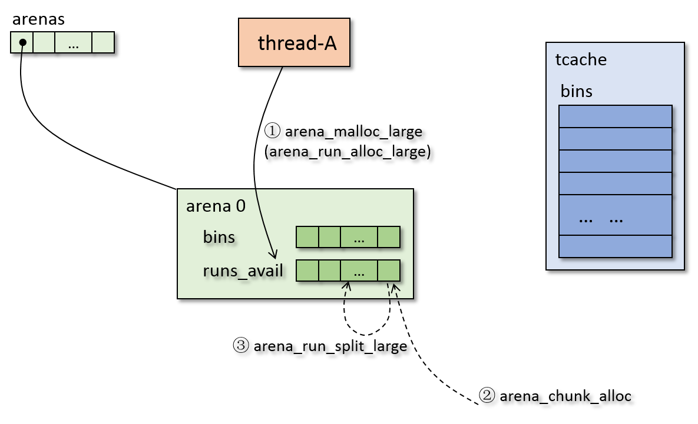
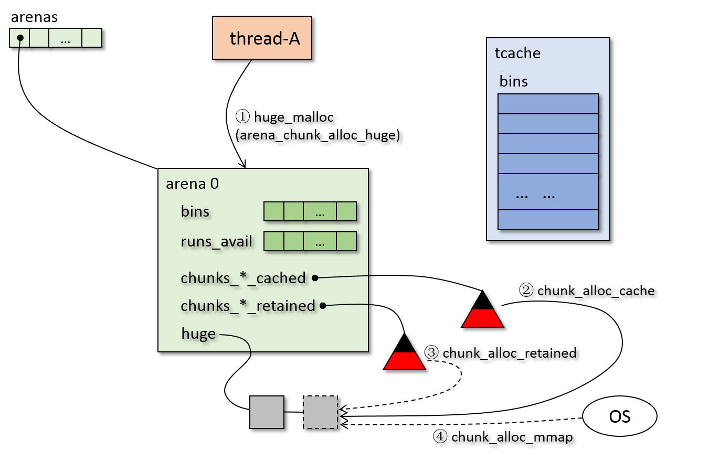
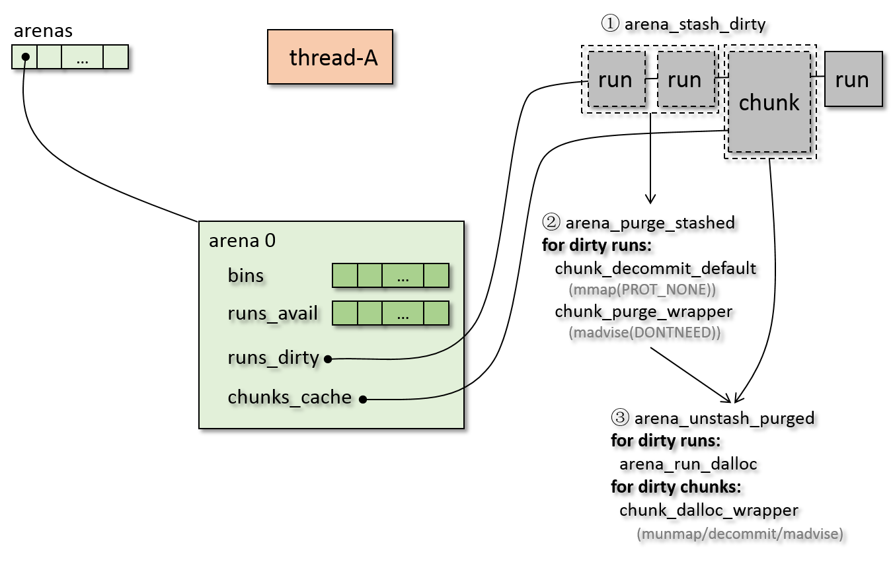

## malloc 流程
这部分主要讲解 jemalloc 的 malloc 过程，先来看一下 malloc 的整体流程：(其中会涉及
很多子过程，子过程会在后面一一介绍)
```
je_malloc (jemalloc.c)
jemalloc 已经初始化过，malloc_slow 正常情况为 false
|
+--ialloc_body (jemalloc.c)
|  |
|  +--tsd_fetch (tsd.h)
|  |  获取 tsd ( thread specific data )
|  |
|  +--根据 size 获得 ind
|  |
|  +--ialloc (jemalloc.c)
|     |
|     +--tcache_get (tsd.h)
|     |  从 tsd 中获取 tcache (具体内容见下文)
|     |
|     +--iallocztm (jemalloc.c)
|        |
|        +--arena_malloc (arena.h)
|           malloc 的主体函数
|           |
|           +-[?] tcache!=NULL
|           |  |
|           |  Y--+--size<=SMALL_MAXCLASS
|           |     |  tcache_alloc_small (tcache.h)
|           |     |
|           |     +--size<=tcache_maxclass
|           |        tcache_alloc_large (tcache.h)
|           |
|           +--tcache为NULL 或者 size > tcache_maxclass
|              arena_malloc_hard (arena.c)
|              |
|              +--arena_choose (jemalloc_internal.h)
|              |  获取该线程所属的 arena
|              |
|              +-[?] size <= SMALL_MAXCLASS
|                 |
|                 Y--arena_malloc_small (arena.c)
|                 |  从 arena 中分配 small bin (具体内容见下文)
|                 |
|                [?] size <= large_maxclass
|                 |
|                 Y--arena_malloc_large (arena.c)
|                 |  从 arena 中分配 large (具体内容见下文)
|                 |
|                 N--huge_malloc (huge.c)
|                    分配 huge (具体内容见下文)
|   
+--ialloc_post_check (jemalloc.c)
   做相关检查及统计数据更新
```
简单来说，malloc 流程就是根据 size 大小使用不同方式分配(下面流程是默认开启 tcache 的工作过程)：
* small bin ： 从 tcache 分配，如果 tcache 没有，则 tcache 从 arena 获取元素填充 tcache，
然后再从 tcache 获取
* large <= tcache_maxclass ： 优先从 tcache 分配，如果 tcache 没有，则从 arena 分配
* large > tcache_maxclass ： 从 arena 分配
* huge ： 使用 huge_malloc 分配

这里需要说明的是，jemalloc 的 tcache 是可以关闭的，将 tcache 关闭的话，那么 tcache 一直为 NULL，
则 small、large、huge 分别走 arena_malloc_small、arena_malloc_large、huge_malloc 接口。
(下文内容大部分都是针对默认开启 tcache 的情况讲述的)

上述流程中，将 arena_malloc 的执行流程也一起写进去了，下面很多过程会用到 arena_malloc，
可以参照上述内容。

上述过程中 tcache_get 大部分情况下过程很简单，但是如果 tcache 还没初始化，那么过程
就会很复杂，具体过程如下：
```
tcache_get (tcache.h)
|
+--tsd_tcache_get (tsd.h)
|  从 tsd 中获取 tcache (该函数是使用 宏 生成的)
|
+-[?] tcache==NULL 及 tsd 状态为 nominal
   |
   Y--+--tcache_get_hard (tcache.c)
      |  |
      |  +--arena_choose (jemalloc_internal.h)
      |  |  选择 application arena
      |  |  |
      |  |  +--arena_choose_impl (jemalloc_internal.h)
      |  |     |
      |  |     +--tsd_arena_get
      |  |     |
      |  |     +-[?] arena==NULL
      |  |        |
      |  |        Y--arena_choose_hard (jemalloc.c)
      |  |           为该线程选取 arena (具体内容见下文)
      |  |
      |  +--tcache_create (tsd.c)
      |     为 tcache 分配空间并初始化
      |     (调用 ipallocztm 时，传入参数 arena=arena[0], is_metadata=true，
      |      所以，在 arena 0 上为 tcache 分配空间)
      |     |
      |     +--计算 tcache 的大小，包括 tcache_bin 和 bin 的 stack elements
      |     |
      |     +--ipallocztm (jemalloc_internal.h)
      |     |  为 tcache 分配空间
      |     |  
      |     +--tcache_arena_associate
      |     |  将 tcache 放入 arena->tcache_ql
      |     |
      |     +--ticker_init
      |     |  初始化 ticker
      |     |
      |     +--初始化 tcache->tbins[i].avail，指向各 bin 的 stack
      |
      +--tsd_tcache_set
         将 tcache 设置到 tsd 中
```
tcache 创建过程中使用了 ipallocztm 为 tcache 分配空间，ipallocztm 可以提供有指定对齐
需求的内存分配，而 iallocztm 则提供没有特殊对齐需求的内存分配，下面给出 ipallocztm 的
执行流程：
```
ipallocztm (jemalloc_internal.h)
提供有指定对齐需求的内存分配
|
+--arena_palloc (arena.c)
|  提供有指定对齐需求的内存分配，比如大于页对齐的内存分配
|  (然而并不严格满足对齐需求，如 small 时，如果对齐需求小于 page，则不考虑对齐需求)
|  |
|  +-[?] usize <= SMALL_MAXCLASS 且 对齐要求不大于 PAGE
|     |
|     Y--arena_malloc (arena.h)
|     |  (具体内容见上文)
|     |
|    [?] usize <= large_maxclass & alignment <= PAGE
|     |
|     Y--+--arena_malloc (arena.h)
|     |  |  (具体内容见上文)
|     |  |
|     |  +--如果设置了 config_cache_oblivious，正则一下地址
|     |
|    [?] usize <= large_maxclass
|     |
|     Y--arena_palloc_large
|     |  为 large size 但是 alignment 大于 page 对齐的请求分配内存
|     |  思路是在头部添加空隙，使得对齐满足要求，然后用新的尺寸申请空间
|     |  最后再回收多余的头部、尾部
|     |  (具体实现见代码)
|     |
|    [?] alignment <= chunksize
|     |
|     Y--huge_malloc
|     |  (具体内容见下文)
|     |
|     N--huge_palloc
|        (具体内容见下文)
|
+--arena_metadata_allocated_add (arena.h)
   更新统计参数
```

下面来看从 tcache 中分配 small 的过程，先看一个简易的流程图:

从上图只简要列出了从 tcache 分配 small 的重要步骤，下面做一些解释：
* 步骤一：从 tcache 中获取该 bin，如果 tcache 中有，申请成功，不执行下面的步骤；如果
tcache 中没有，那么执行步骤二
* 步骤二：从 arena 的 bin 中获得元素填充 tcache，如果 arena 中有足够的元素填充，
那么填充之后返回步骤一进行分配；如果 arena 的 bin 中没有足够的元素，那么触发步骤三
* 步骤三：从 arena 的 runs_avail 中找到满足的 run，分配给 arena 的 bin，如果
runs_avail 能找到，那么返回步骤二(找到比该small run大的也可以，jemalloc中会做切分)；
如果找不到，那么触发 步骤四、步骤五
* 步骤四、五：申请一个新的 chunk，并将新 chunk 切成合适的 run 放入 runs_avail 中，
返回步骤三

上述流程很好地体现了 jemalloc 的分层设计，首先从 tcache 中取，其次从 arena 中取，
最后从操作系统申请新的块，这样的分层设计配合逐层缓存，使得大部分时候分配很迅速、高效。

现在来看看上述流程的详细解释：
```
tcache_alloc_small (tcache.h)
从 tcache 中分配 small bin
|
+--tcache_alloc_easy (tcache.h)
|  如果 tbin->avail 中有元素，则分配成功
|  同时 更新 tbin->low_water
|
+--上一步失败
|  tcache_alloc_small_hard (tcache.c)
|  |
|  +--arena_tcache_fill_small (arena.c)
|  |  从 arena 中获取内存填充 tcache
|  |  |
|  |  +--根据 tbin->lg_fill_div, tbin->ncached_max 计算需要填充的数量
|  |  |
|  |  +--重复调用 arena_run_reg_alloc,arena_bin_malloc_hard填充 tbin
|  |  |  arena_run_reg_alloc 从 runcur 获取 region (具体内容见下文)
|  |  |  arena_bin_malloc_hard寻找可用的 run 来替补 runcur (具体内容见下文)
|  |  |
|  |  +--arena_decay_tick (arena.h)
|  |     更新 ticker，并可能触发 arena_purge 内存清理
|  |
|  +--tcache_alloc_easy (tcache.h)
|
+--tcache_event (tcache.h)
   更新 ticker，并可能出发 tcache_event_hard 对 bin 进行回收
   (具体内容见下文)
```
上述流程中，arena_run_reg_alloc 的过程很简洁，就是根据 bitmap 来获得 region，
如果当前 run 中没有可用的 region，那么使用 arena_bin_malloc_hard 从 bin->runs
中选出一个run 来分配，如果 bin->runs 中也没有可用的，那么会触发 arena_run_alloc_small，
下面给出 arena_bin_malloc_hard 的流程：
```
arena_bin_malloc_hard (arena.c)
获取 run 填充 runcur，然后再分配
|
+--run = arena_bin_nonfull_run_get (arena.c)
|  |
|  +--arena_bin_nonfull_run_tryget (arena.c)
|  |  从 bin->runs 中尝试获得一个 run
|  |
|  +-[?] 上一步 tryget 失败
|  |  |
|  |  Y--arena_run_alloc_small (arena.c)
|  |     从 arena 中分配 run 给该 bin (具体内容见下文)
|  |
|  +--如果上一步 arena_run_alloc_small 也失败了
|     再尝试一次 arena_bin_nonfull_run_tryget
|     (因为中间有换锁，可能有其他线程填充了runs)
|
+--如果其他线程填充了 runcur
|  |
|  +--arena_run_reg_alloc 从 runcur 分配 reg
|  |
|  +--如果 run 是满的，用 arena_dalloc_bin_run 回收
|     否则调用 arena_bin_lower_run 将 run、runcur
|           中地址低的变成新的 runcur，另一个放回 runs
|
+--runcur=run
   arena_run_reg_alloc 从 runcur 分配 reg
```
上述过程会触发 arena_run_alloc_small，下面给出该过程的流程：
```
arena_run_alloc_small (arena.c)
从 arena 中分配合适的 run 给某个 bin
|
+--arena_run_alloc_small_helper (arena.c)
|  |
|  +--arena_run_first_best_fit (arena.c)
|  |  |
|  |  +--size->run_quantize_ceil->size2index
|  |  |  先将 size 转换成 真实 run 应该有的大小
|  |  |  再转换成 index，从而映射成 runs_avail 下标
|  |  |
|  |  +--使用 arena_run_heap_first 在 arena->runs_avail 中找到合适的run
|  |
|  +--arena_run_split_small (arena.c)
|     |
|     +--获得一些参数
|     |
|     +--如果该 run 内存被 decommitted，调用 chunk_commit_default 将内存 commit
|     |
|     +--arena_run_split_remove (arena.c)
|     |  切分出需要的 run，将剩余的空间组成新的 run 再放回 runs_avail
|     |  |
|     |  +--arena_avail_remove
|     |  |  从 runs_avail 中移除该 run
|     |  |  此处使用 run_quantize_floor 去调整
|     |  |  因为实际 run 的尺寸会大于其所在 ind的尺寸
|     |  |
|     |  +--如果是dirty，则用 arena_run_dirty_remove从
|     |  |      runs_dirty 中删去该 run 的 map_misc
|     |  |  因为 runs_dirty 是一个双向环形链表
|     |  |  删除的时候将该run自己的map_misc的指针
|     |  |      进行修改就可以完成在链表中删除自己
|     |  |
|     |  +--arena_avail_insert
|     |     将多余的页面返回到 arena->runs_avail
|     |     多余的页面使用 run_quantize_floor 确定 ind
|     |
|     +--初始化 run 的 mapbits
|
+--上一步失败，调用 arena_chunk_alloc (arena.c)
|  (上一步失败，说明没有可用的 run，需要申请新的 chunk)
|
+-[?] chunk 分配成功
   |  chunk 分配成功初始化的时候，会自动有一个maxrun
   |
   Y--arena_run_split_small (见上面的流程)
   |
   N--其他线程可能给该 arena 分配了 chunk
      再试一次arena_run_alloc_small_helper
```
上述过程中会从 runs_avail 中寻找可用的run，从该run中切出需要的部分，剩下的放回 runs_avail，
如果 runs_avail 中也没有可用的，那么会触发 chunk 的分配。

对于 chunk，需要指出的是在 jemalloc 中，chunk 不仅仅是
chunksize 大小的 chunk，大于 chunksize 的 huge 也认为是 chunk。根据我的观察，大部分
arena_chunk_* 形式的函数是操作 chunksize 的 chunk，即用来切分成 run 的 arena chunk，
而 chunk_* 形式的函数大部分是不加区分的操作 chunk 和 huge，即用来操作大内存。
所以，之后文中也将用来切分成 run 的 chunk 称为 arena chunk，而 chunk 则用来不加区分的
形容 chunk 和 huge。

下面看看 chunk 的分配：
```
arena_chunk_alloc (arena.c)
分配 arena chunk
|
+-[?] arena->spare != NULL
|  |  spare 中记录着上次释放的 chunk
|  |
|  Y--arena_chunk_init_spare (arena.c)
|  |  将 arena->spare 作为新 chunk，并将 spare 置为 NULL
|  |
|  N--arena_chunk_init_hard (arena.c)
|     |
|     +--arena_chunk_alloc_internal (arena.c)
|     |  |
|     |  +--chunk_alloc_cache
|     |  |  使用 chunk_recycle 从 chunks_szad_cache/chunks_ad_cache 中分配 chunk
|     |  |  (chunk_recycle 的具体内容见下文)
|     |  |
|     |  +-[?] 上一步分配成功
|     |     |
|     |     Y--+--arena_chunk_register (arena.c)
|     |     |  |  |
|     |     |  |  +--extent_node_init 初始化 chunk->node
|     |     |  |  |
|     |     |  |  +--chunk_register
|     |     |  |     将 chunk 在 rtree 中登记
|     |     |  |     rtree--radix tree--基数树
|     |     |  |
|     |     |  +--注册失败，调用chunk_dalloc_cache
|     |     |     (chunk_dalloc_cache 具体内容在 free 部分)
|     |     |
|     |     N--arena_chunk_alloc_internal_hard (arena.c)
|     |        |
|     |        +--chunk_alloc_wrapper (chunk.c)
|     |        |  实际分配 chunk 空间
|     |        |
|     |        +--如果 chunk 的地址未 commit(false)，则尝试 commit 其地址
|     |        |  如果 commit 失败，则调用 chunk_dalloc_wrapper 释放 chunk，并返回
|     |        |  (chunk_dalloc_wrapper 具体内容见下文)
|     |        |  (如果操作系统是 overcommit 的，上一步chunk_alloc_wrapper
|     |        |   会置 commit 为 true)
|     |        |
|     |        +-[?] arena_chunk_register 成功
|     |           |
|     |           N--chunk_dalloc_wrapper (chunk.c)
|     |              释放 chunk (具体内容见下文)
|     |
|     +--调用 arena_mapbits_unallocated_set
|        初始化 chunk 的 mapbits
|
+--ql_tail_insert
|  将该 chunk 插入到 arena->achunks
|
+--arena_avail_insert
   将该 chunk 的 maxrun 插入 runs_avail
```
上述流程还是比较清晰的，不过这里需要做一些说明：
* 结合前面的数据结构中的说明，chunks_szad/ad_cache 中是 dirty chunks，即有物理地址映射
的 chunks； chunks_szad/ad_retained 中是 clean chunks，即只有地址空间，没有物理地址
* chunks_szad/ad_* 是通过 extent node 链接的，对于 arena chunk，node 在其内部，对于
huge chunk，node 在 chunk 外面
* 如果操作系统是 overcommit 的，那么上述关于 commit 的操作都可以忽略。如果操作系统没有
设置 overcommit，那么在需要的时候会调用 commit 操作来恢复物理内存映射

现在看看在 tcache 中分配较小的几类 large 的情形：

大致过程：
* 步骤一：从 tcache 中申请 large，如果tcache 中有，那么返回，如果没有，那么执行步骤二
* 步骤二及步骤二可能触发的步骤三、四其实就是下一种情况——从 arena 中分配 large，所以具体内容见
下一种情形

上述是简易的流程，下面看看详细的代码流程：
```
tcache_alloc_large (tcache.h)
从 tcache 中分配 large
|
+--tcache_alloc_easy
|  如果 tbin->avail 中有元素，则分配成功
|  同时 更新 tbin->low_water
|
+--上一步失败
|  arena_malloc_large (arena.c)
|  (具体内容见下文)
|
+--tcache_event (tcache.h)
```

上述过程中的 arena_malloc_large 和从 arena 中分配 large 是一个函数，下面给出简易流程图：

* 步骤一：从 arena 的 runs_avail 中寻找可用的 run (找到比该run大的也可以，jemalloc 会做切分)，
如果找到，那么返回，如果找不到，那么执行步骤三、四
* 步骤二、三：向操作系统申请新的 chunk，并将 chunk 切成合适的 run，返回步骤二

下面给出在 arena 中分配 large 的详细执行流程：
```
arena_malloc_large (arena.c)
在 arena 中分配 large run
|
+--如果设置了 cache_oblivious,对地址进行随机化
|
+--arena_run_alloc_large (arena.c)
|  这里分配 large run 时，会添加上 large_pad，为 cache_oblivious 功能提供空间
|  |
|  +--arena_run_alloc_large_helper (arena.c)
|  |  |
|  |  +--arena_run_first_best_fit (arena.c)
|  |  |  (具体过程见上文)
|  |  |
|  |  +--arena_run_split_large (arena.c)
|  |     |
|  |     +--arena_run_split_large_helper (arena.c)
|  |        |
|  |        +--如果该 run 内存被 decommitted，调用 chunk_commit_default 将内存 commit
|  |        |
|  |        +--arena_run_split_remove
|  |        |  (具体过程见上文)
|  |        |
|  |        +--对分配的 run 初始化并设置一些标记
|  |           如果需要对 large run 清零，则使用 arena_run_zero 清零内存
|  |
|  +--上一步分配失败，说明没有可用run
|  |  arena_chunk_alloc 分配 chunk
|  |  (具体内容见上文)
|  |
|  +-[?] chunk 分配成功
|     |
|     Y--arena_run_split_large (arena.c)
|     |  (具体内容见上文)
|     |
|     N--arena_run_alloc_large_helper
|        上述换锁时，可能有其他线程添加了run，再试一次
|
+--更新统计参数
|
+--arena_decay_tick
   更新 ticker，并可能触发 arena_purge 内存清理
```

最后一种情况是 huge 的分配：

其主要流程是：
* 步骤一：向 arena 申请分配 huge
* 步骤二：arena 在本地 chunks_szad/ad_cached 缓存中寻找合适的空间，如果找到就返回，如果
找不到，那么执行步骤三
* 步骤三：arena 在本地 chunks_szad/ad_retained 中寻找合适的地址，如果找到则返回，如果找不到，
那么执行步骤四
* 步骤四：从 操作系统中通过 map 申请空间

下面看一下详细的流程：
```
huge_malloc (huge.c)
|
+--huge_palloc (huge.c)
   |
   +--ipallocztm (jemalloc_internal.h)
   |  为 chunk 的 extent node 分配空间
   |  (这里似乎是在 thread 自己的 arena 上分配的 huge 的 extent node)
   |
   +--arena_chunk_alloc_huge (arena.c)
   |  |
   |  +--chunk_alloc_cache (chunk.c)
   |  |  (具体内容见下文)
   |  |
   |  +--上一步失败
   |     arena_chunk_alloc_huge_hard (arena.c)
   |     |
   |     +--chunk_alloc_wrapper
   |        (具体内容见下文)
   |
   +--上一步分配失败，调用 idalloctm 释放 extent node
   |  idalloctm 会调用 arena_dalloc 来释放空间
   |  (idalloctm 具体内容见 free 部分)
   |
   +--huge_node_set (huge.c)
   |  huge_node_set 会调用 chunk_register 在 基数树中注册
   |  如果该步失败，则释放 node、huge chunk
   |
   +--调用 ql_tail_insert 将 node 插入 arena->huge
   |
   +--arena_decay_tick
      更新 ticker，并可能触发 arena_purge 内存清理
```

对于 tcache 关闭的情况，还有一个过程 arena_malloc_small，从arena 中分配 small：
```
arena_malloc_small (arena.c)
|
+--根据 ind 选出 bin=arena->bins[ind]
|
+-[?] (run=bin->runcur)!=NULL & run->nfree>0
|  |
|  Y--arena_run_reg_alloc (arena.c)
|  |  根据 run 的 bitmap 找出第一个可用的 region
|  |  根据 ind、offset 等信息算出 region 地址
|  |
|  N--arena_bin_malloc_hard (arena.c)
|     (具体内容见上文)
|
+--更新统计数据
|
+--根据 junk 等参数配置本次分配
|
+--arena_decay_tick (arena.h)
   更新 ticker，并可能触发 arena_purge 内存清理

```

下面给出上述内容中用到的一些子过程。

上述chunk分配中使用到了 chunk_recycle，其作用是从 chunks_szad/ad_* 中回收 chunk：
```
chunk_recycle (chunk.c)
在 chunks_szad,chunks_ad 中回收 chunk
|
+-[?] new_addr != NULL，说明根据地址分配
|  |
|  Y--+--extent_node_init (extent.h)
|  |  |  使用 addr,size 初始化node
|  |  |
|  |  +--extent_tree_ad_search
|  |     使用地址在 chunks_ad 中查找
|  |
|  N--chunk_first_best_fit
|     使用 extent_tree_szad_nsearch 在 chunk_szad 中查找
|
+--没找到node，或者找到的node太小
|  返回 NULL
|
+--根据对齐要求，得到多余的头部、尾部
|  (leadsize, trailsize)
|
+--extent_tree_szad_remove, extent_tree_ad_remove
|  从chunks_szad, chunks_ad 删除node
|
+--arena_chunk_cache_maybe_remove
|  如果 chunk 是dirty，则从arena->chunks_cache, arena->runs_dirty 中删除
|
+--如果头部有多余，那么
|  extent_tree_szad_insert 插入 chunks_szad
|  extent_tree_ad_insert 插入 chunks_ad
|  arena_chunk_cache_maybe_insert 根据是否 dirty/cache 插入 chunks_cache, runs_dirty
|
+--如果尾部有多余，那么
|  |
|  +--chunk_hooks->split
|  |  实际调用 chunk_split_default
|  |  地址空间就是一个数值，切分没有实际操作
|  |  chunk_split_default 返回 false,表示成功
|  |
|  +--如果 node 为 NULL, 调用 arena_node_alloc 为 chunk node 分配空间
|  |  arena_node_alloc 使用 base_alloc 为 node 分配空间
|  |  分配失败，则调用 chunk_record，这里调用 chunk_record 是为了再次尝试分配空间，
|  |  并将 多余空间 放回树中，然后返回
|  |
|  +--node 不为 NULL，将尾部空间放回 chunks_sazd,chunks_ad
|  |  根据 dirty/cache 决定是否放回 runs_dirty,chunks_cache
|  |
|  +--如果 chunk 内存空间未 commit，则调用 chunk_commit_default
|     如果 commit 失败，调用 chunk_record 将 chunk 再放回 chunks_szad/ad 树中
|
+--如果有必要，arena_node_dalloc 将 node 放回 arena->node_cache
   node 是通过 base_alloc 分配的，如果不使用了，需要返回 node_cache 缓存，便于下次使用
```
上述过程涉及到较多的数据结构的信息，需要熟悉数据结构部分的内容，如果有疑问，可以到
结合数据结构部分再看看。

下面说明 chunk 的实际分配函数和实际释放函数：
```
chunk_alloc_wrapper
chunk 的实际分配函数
|
+--chunk_alloc_retained
|  |
|  +--chunk_recycle
|     在 chunks_szad_retained,chunks_ad_retained 中回收 chunk
|
+-[?] 上一步失败
   |
   +--chunk_alloc_default_impl
      |
      +--chunk_alloc_core
         根据策略使用 chunk_alloc_dss 或者
         chunk_alloc_mmap 分配 chunk
         (默认使用 mmap)
         |
         +--chunk_alloc_dss
         |  使用 sbrk 申请地址空间
         |  (详细过程见代码及注释)
         |
         +--chunk_alloc_mmap
            使用 mmap 申请地址空间
            (详细过程见代码及注释)


chunk_dalloc_wrapper
chunk 的实际回收函数
|
+--chunk_dalloc_default_impl
|  如果addr不在dss中，使用
|  chunk_dalloc_mmap/pages_unmap 释放空间
|
+--上述释放成功，返回
|
+--chunk_decommit_default
|  调用pages_decommit/pages_commit_impl
|  来 decommit 地址，如果 os_overcommit!=0,
|  则不 decommit，否则使用mmap(PROT_NONE)来
|  decommit 地址空间
|  (默认os_overcommit不为0，所以什么都不做,decommit失败)
|
+--如果decommit失败，调用chunk_purge_default
|  使用 madvise 来 释放地址空间
|
+--chunk_record
   将 地址空间 放到 chunks_szad/ad_retained
   树中，可供之后的chunk申请使用。
   (retained 树中是有地址空间，但是没有实际
    物理内存的，而cached树中是有物理内存映射
    的，所以申请chunk时，cached树优先级更高)
```

上面和 malloc 有关的主要函数都解释过了，现在还有一些调用链上的其他功能和函数，下面
来看一下，主要是 ticker、内存回收 等相关函数。

先来看一下 ticker 相关的：
```
arena_decay_tick
更新 ticker 值，并可能出发内存回收
|
+--arena_decay_ticks (arena.h)
   |
   +--decay_ticker_get
   |  从 tsd 中拿到属于对应该 arena 的 ticker
   |  (详细过程见下文)
   |
   +-[?] ticker_ticks
      ticker 到了，返回 true，否则 ticker 减去某个值
      |
      Y--arena_purge
         调用 arena_purge 清理内存(all=false)
         (具体内容见下文)
```

上述过程中需要从 tsd 中获取 ticker，其过程如下：
```
decay_ticker_get (jemalloc_internal.h)
在线程 tsd 中获取指定 arena 的 ticker (如果没有，就新建一下)
每个线程都为所有 arena 保存 ticker，但是一般一个线程只用两个 arena
|
+--arena_tdata_get (jemalloc_internal.h)
   |
   +--arenas_tdata = tsd_arenas_tdata_get
   |  获取 tsd 中的 arenas 的 ticker 数组
   |
   +-[?] arenas_tdata == NULL
   |  数组是否为空，为空则需要初始化
   |  |
   |  Y--arena_tdata_get_hard
   |
   +-[?] ind >= tsd_narenas_tdata_get
   |  要获得的 ticker 超出数组的长度
   |  |
   |  Y--arena_tdata_get_hard
   |
   +--arena_tdata_get_hard


arena_tdata_get_hard
|
+--如果 ticker 数组太小，就新建数组，并将原数组复制到新数组
   如果原来没有 ticker 数组，就新建数组并初始化
   (具体实现见源码)
   ticker 数组空间的分配/释放使用 a0malloc/a0dalloc
   a0malloc--a0ialloc--iallocztm--arena_malloc 在 arena 0 上分配
   a0dalloc--a0idalloc--idalloctm--arena_dalloc 完成释放

```

ticker 事件会触发内存回收操作，下面给出了 ticker 触发 arena_purge 函数的内容：
```
arena_purge (arena.c)
回收内存
|
+-[?] all
   |
   Y--arena_purge_to_limit
   |  清除 dirty 的内存地址
   |  两种模式：ratio，decay
   |  ratio: 清除尽可能少的run/chunk使得 arena->ndirty <= ndirty_limit
   |  decay: 清除尽可能多的run/chunk使得 arena->ndirty >= ndirty_limit
   |  |
   |  +--新建 purge_runs_sentinel, purge_chunks_sentinel 链表
   |  |  用来暂存需要释放的 run 和 chunk
   |  |
   |  +--arena_stash_dirty
   |  |  从 runs_dirty,chunks_cache 中获得 dirty run 和 dirty chunk
   |  |  如果是 dirty chunk, 从 chunk_szad/ad_cached 中移除，并放入 purge_chunks_sentinel
   |  |  如果是 dirty run, 使用 arena_run_split_large 分配出来，并放入 purge_runs_sentinel
   |  |  如果 dirty run 的 chunk 是 arena->spare，则先将 spare 用 arena_chunk_alloc 分配
   |  |  暂存过程中根据 ratio、decay 的条件，选择结束的时机
   |  |  (具体实现见代码)
   |  |
   |  +--arena_purge_stashed
   |  |  如果是 chunk，暂不清理，因为可能是 arena chunk，链接信息在其内部，
   |  |  清理会使 purge_chunks_sentinel 链表断裂
   |  |  如果是 run，则清理：通过 chunk_decommit_default 或者 chunk_purge_wrapper
   |  |  释放物理地址映射、设置 mapbit 标记
   |  |  (具体实现见代码)
   |  |
   |  +--arena_unstash_purged
   |     对上一步未清理的 chunk 进行实际的清理 (chunk_dalloc_wrapper)
   |     对上一步的 run，调用 arena_run_dalloc 执行 run 的回收
   |     (具体实现见代码) (arena_run_dalloc 的具体内容见 free 部分)
   |
   N--arena_maybe_purge
      |
      +-[?] opt_purge == purge_mode_ratio
         |
         Y--arena_maybe_purge_ratio
         |  根据 lg_dirty_mult 计算需要清理的页面数
         |  根据计算结果决定调用 arena_purge_to_limit 清理页面的数量
         |
         N--arena_maybe_purge_decay
            根据 时钟、decay 参数 计算需要清理的页面数(具体计算过程没有细看)
            根据计算结果决定调用 arena_purge_to_limit 清理页面的数量

```
上述过程中：
* arena_purge_stashed 中对于 run 调用 chunk_decommit_default 或者 chunk_purge_wrapper
来释放 run 的物理内存，chunk_decommit_default 和 chunk_purge_wrapper 是用来对 chunk
内的部分内存释放其物理页面的，很多时候都是用在 run 上的，而对于 chunk，一般使用
chunk_dalloc_wrapper
* 内存回收，对于 chunk，意味着释放物理内存，将地址空间放到 chunks_szad/ad_retained 中，
对于 run，意味着释放物理内存，将 run 从 runs_avail、runs_dirty 中删除，放回 chunk 中

这里给出一张 内存清理的大致流程图：


最后，对 tcache 的回收做一些说明：
```
tcache_event
tcache 内存回收
|
+-[?] ticker_tick
   |
   +--tcache_event_hard
      对某一个 tbin 进行回收
      |
      +--获取本次回收对象 tcache->next_gc_bin
      |
      +-[?] binind < NBINS
      |  |
      |  Y--tcache_bin_flush_small
      |  |  将部分内存放回 arena
      |  |  (具体内容见 free 部分)
      |  |
      |  N--tcache_bin_flush_large
      |     将部分内存放回 arena
      |     (具体内容见 free 部分)
      |
      +--根据 low_water 动态调整填充度lg_fill_div
      |
      +--设置下一次回收的ind

```


### 源码解析
* arane_choose_hard
   同时选取 application arena 和 internal arena
   按照 负载为零>未初始化>负载最轻 的优先级选取
   如果选了未初始化的 arena, 则调用 arena_init_locked
   先初始化 (初始化流程见 init.md)
   选择完成后，使用 arena_bind 绑定 tsd、arena
   根据 internal 参数返回 结果

* arena_run_first_best_fit 及 arena_avail_remove, arena_avail_insert 中的 
run_quantize_floor/ceil 的使用，及 run 的index 确定

* arena_run_split_remove 切分过程

* chunk_recycle
